

**UNIVERSIDAD PRIVADA DE TACNA**

**FACULTAD DE INGENIERIA**

**Escuela Profesional de Ingeniería de Sistemas**

**Proyecto *NotaryVerify***

Curso: *Calidad y Pruebas de Software*

Docente: *Patrick Jose Cuadros Quiroga*

Integrantes:

***Cohaila Alvarado, Gabriela Estefania (2022075746)***

***Vargas Luque, Jhony (2022075754)***

**Tacna – Perú**

***2026***

\pagebreak

Sistema *NotaryVerify*

Documento de Arquitectura de Software

Versión *1.0*

|CONTROL DE VERSIONES||||||
| :-: | :- | :- | :- | :- | :- |
|Versión|Hecha por|Revisada por|Aprobada por|Fecha|Motivo|
|1\.0|GC, JV|PJCQ|PJCQ|20/09/2026|Versión Original|

\pagebreak

# **INDICE GENERAL**

1. Introducción

1.1. Propósito (Diagrama 4+1)

1.2. Alcance

1.3. Definición, siglas y abreviaturas

1.4. Organización del documento

2. Objetivos y restricciones arquitectónicas

2.1. Priorización de requerimientos

2.1.1. Requerimientos Funcionales

2.1.2. Requerimientos No Funcionales – Atributos de Calidad

2.2. Restricciones

3. Representación de la arquitectura del sistema

3.1. Vista de Caso de uso

3.2. Vista Lógica

3.3. Vista de Implementación (vista de desarrollo)

3.4. Vista de procesos

3.5. Vista de Despliegue (vista física)

4. Atributos de calidad del software

4.1. Escenario de Funcionalidad

4.2. Escenario de Usabilidad

4.3. Escenario de Confiabilidad

4.4. Escenario de Rendimiento

4.5. Escenario de Mantenibilidad

4.6. Otros Escenarios

\pagebreak

**<u>Informe de Arquitectura de Software</u>**

# 1. INTRODUCCIÓN

## 1.1. Propósito (Diagrama 4+1)

El presente documento describe la arquitectura del sistema **NotaryVerify**, prototipo experimental de verificación multicapa de identidad para trámites notariales simulados, desarrollado en el marco del curso Calidad y Pruebas de Software del semestre 2026-II.

La arquitectura se documenta siguiendo el **modelo de vistas 4+1 de Kruchten**, que permite describir un sistema desde perspectivas complementarias, cada una dirigida a un interesado distinto. Las cinco vistas empleadas son:

| Vista | Pregunta que responde | Interesado principal |
| :- | :- | :- |
| Vista de Casos de Uso (+1) | ¿Qué debe hacer el sistema y para quién? | Docente, equipo de proyecto |
| Vista Lógica | ¿Cómo se estructuran las clases, objetos y datos del dominio? | Desarrolladores, analistas |
| Vista de Implementación | ¿Cómo se organiza el código fuente en paquetes y componentes? | Desarrolladores |
| Vista de Procesos | ¿Cómo fluye el control durante la ejecución? | Desarrolladores, responsables de pruebas |
| Vista de Despliegue | ¿Sobre qué nodos físicos se ejecuta el sistema? | Responsable de infraestructura |

A diferencia de un documento de arquitectura elaborado antes de la construcción, este informe describe una arquitectura **ya implementada y verificada**: el backend, el frontend y la batería de pruebas automatizadas se encuentran desarrollados en el repositorio del proyecto. Por ello, los diagramas que se presentan reflejan la estructura real del código fuente y no un diseño tentativo.

El objetivo del documento es dejar constancia de las decisiones arquitectónicas adoptadas, justificar su relación con los requerimientos establecidos en el FD03 (Especificación de Requerimientos de Software) y proporcionar una base técnica para la continuidad académica del proyecto.

## 1.2. Alcance

El alcance de este documento abarca la descripción arquitectónica completa del prototipo NotaryVerify, incluyendo su estructura en capas, sus componentes, su modelo de datos, sus flujos de ejecución y su esquema de despliegue.

**Dentro del alcance del documento se considera:**

- La descripción de las cinco vistas del modelo 4+1 aplicadas al sistema implementado.
- El modelo de clases y el modelo de base de datos derivados de los modelos ORM efectivamente construidos.
- Los diagramas de secuencia correspondientes a los flujos críticos: verificación multicapa, integridad documental y encadenamiento de auditoría.
- La justificación de las decisiones tecnológicas adoptadas (FastAPI, SQLAlchemy, SQLite, OpenCV, MediaPipe).
- Los escenarios de atributos de calidad que orientan la evaluación del prototipo.

**Fuera del alcance del documento se considera:**

- El detalle línea a línea del código fuente, que se encuentra documentado en el propio repositorio.
- La arquitectura de los sistemas oficiales Reniec y SID-Sunarp, que en este proyecto se representan únicamente mediante simuladores desarrollados por el equipo.
- Cualquier consideración de despliegue en producción ante una notaría real, dado el carácter estrictamente académico del prototipo.
- El diseño de la infraestructura de alta disponibilidad, redundancia o balanceo de carga, no aplicable a un prototipo de evaluación controlada.

## 1.3. Definición, siglas y abreviaturas

| Término | Definición |
| :- | :- |
| NotaryVerify | Nombre referencial del sistema objeto del proyecto. |
| Modelo 4+1 | Modelo de vistas arquitectónicas propuesto por Philippe Kruchten, que organiza la descripción de un sistema en las vistas lógica, de implementación, de procesos, de despliegue y de casos de uso. |
| API REST | Interfaz de programación basada en el estilo arquitectónico REST, que expone recursos mediante verbos HTTP. |
| FastAPI | Framework web de Python empleado para construir la API REST del backend. |
| SQLAlchemy | Biblioteca de mapeo objeto-relacional (ORM) utilizada para persistir el modelo de dominio. |
| ORM | Object-Relational Mapping. Técnica que traduce objetos del lenguaje de programación a registros de una base de datos relacional. |
| SQLite | Motor de base de datos relacional embebido, sin servidor, empleado para la persistencia del prototipo. |
| Pydantic | Biblioteca de validación de datos empleada para definir los esquemas de entrada y salida de la API. |
| OpenCV | Biblioteca de visión por computadora de código abierto, utilizada para la detección y comparación facial local. |
| SFace | Modelo de reconocimiento facial del repositorio OpenCV Zoo, empleado para obtener la métrica de similitud entre rostros. |
| MediaPipe Face Landmarker | Herramienta de Google que detecta puntos de referencia faciales, utilizada para evaluar la prueba de vida. |
| EAR | Eye Aspect Ratio. Relación geométrica entre los puntos del contorno ocular que permite detectar el parpadeo. |
| SHA-256 | Algoritmo de hash criptográfico de 256 bits, empleado para la integridad documental y el encadenamiento de la bitácora. |
| Hash chain | Cadena de hashes en la que cada elemento incorpora el hash del elemento anterior, de modo que cualquier alteración posterior es detectable. |
| Simulador de Identidad | Servicio interno que representa, con fines exclusivamente académicos, una consulta de información de identidad, operando sobre identidades ficticias. |
| Simulador SID-Sunarp | Servicio interno que representa el comportamiento del SID-Sunarp para pruebas técnicas de integración, sin sustituir al sistema oficial. |
| Sesión de verificación | Registro único que agrupa la identidad evaluada, los factores aplicados, sus resultados y la decisión final del sistema. |
| CORS | Cross-Origin Resource Sharing. Mecanismo que autoriza a un navegador a consumir una API alojada en un origen distinto. |
| CU | Caso de Uso. |
| RF / RNF | Requerimiento Funcional / Requerimiento No Funcional. |
| RN | Regla de Negocio. |

## 1.4. Organización del documento

El documento se organiza en cuatro capítulos. El **capítulo 1** establece el propósito, el alcance y la terminología empleada. El **capítulo 2** presenta los objetivos arquitectónicos, la priorización de los requerimientos funcionales y no funcionales que condicionan el diseño, y las restricciones impuestas al proyecto. El **capítulo 3** constituye el núcleo del informe y desarrolla las cinco vistas del modelo 4+1, acompañadas de los diagramas correspondientes. El **capítulo 4** especifica los escenarios de atributos de calidad que servirán como criterio de evaluación del prototipo durante la fase de pruebas.

\pagebreak

# 2. OBJETIVOS Y RESTRICCIONES ARQUITECTÓNICAS

El objetivo arquitectónico central de NotaryVerify es garantizar que **ningún factor de verificación evaluado de forma aislada sea suficiente para aprobar una identidad**. Esta premisa, recogida en la regla de negocio RN-01, condiciona toda la estructura del sistema: obliga a separar cada mecanismo de verificación en un servicio independiente y a concentrar la decisión final en un único componente arbitral, el motor de reglas.

De este objetivo se derivan cuatro objetivos arquitectónicos secundarios:

| Objetivo | Decisión arquitectónica asociada |
| :- | :- |
| Aislar cada factor de verificación | Un servicio por factor: credencial, biometría, prueba de vida. Ninguno emite el veredicto final. |
| Concentrar la decisión | Un único motor de reglas evalúa la combinación de factores y produce el resultado. |
| Garantizar la trazabilidad | Toda operación crítica se registra en una bitácora con encadenamiento criptográfico. |
| Permitir la evaluación de fallos externos | Las dependencias externas se representan mediante simuladores con escenarios de error configurables. |

## 2.1. Priorización de requerimientos

Los requerimientos que se listan a continuación corresponden a los definidos en el FD03 (Especificación de Requerimientos de Software) y se presentan aquí priorizados según su impacto sobre la arquitectura. Se incluye una columna adicional que identifica el componente que satisface cada requerimiento.

### 2.1.1. Requerimientos Funcionales

| ID | Requerimiento Funcional | Prioridad | Componente responsable |
| :- | :- | :-: | :- |
| RF-01 | Registrar una identidad ficticia en el Simulador de Identidad, con documento, nombres, fotografía de referencia y estado. | Alta | `identidad_service` |
| RF-02 | Consultar una identidad registrada mediante su identificador. | Alta | `identidad_service` |
| RF-03 | Emitir una credencial de prueba (QR o RFID) asociada a una identidad simulada. | Alta | `credencial_service` |
| RF-04 | Leer una credencial para recuperar el registro correspondiente, sin aprobar la identidad por sí sola. | Alta | `credencial_service` |
| RF-05 | Capturar el rostro del participante mediante cámara durante la verificación. | Alta | `routes_verificacion` |
| RF-06 | Comparar el rostro capturado con la referencia registrada y devolver una métrica de confianza. | Alta | `biometria_service` |
| RF-07 | Solicitar una acción aleatoria (parpadeo, giro) y validar su cumplimiento. | Alta | `liveness_service` |
| RF-08 | Combinar los resultados de credencial, rostro y prueba de vida para determinar el resultado final. | Alta | `reglas_service` |
| RF-09 | Registrar cada sesión con los factores utilizados, resultados, fecha, hora y responsable. | Alta | `verificacion_service` |
| RF-10 | Calcular el hash SHA-256 de un documento de prueba generado tras una verificación aprobada. | Alta | `documento_service` |
| RF-11 | Comparar el hash almacenado con el hash actual de un documento para detectar modificaciones. | Alta | `documento_service` |
| RF-12 | Generar un código QR de verificación asociado al documento, sin incluir información personal. | Media | `documento_service` |
| RF-13 | Registrar cada operación crítica en la bitácora, enlazándola con el evento anterior. | Alta | `auditoria_service` |
| RF-14 | Detectar si algún evento de la bitácora fue alterado, verificando el encadenamiento. | Alta | `auditoria_service` |
| RF-15 | Enviar un trámite ficticio al Simulador SID-Sunarp solo si la sesión asociada fue aprobada. | Media | `sid_sunarp_service` |
| RF-16 | Representar escenarios de disponibilidad, error de respuesta y tiempo de espera agotado. | Media | `sid_sunarp_service` |

### 2.1.2. Requerimientos No Funcionales – Atributos de Calidad

| ID | Requerimiento No Funcional | Categoría | Impacto arquitectónico |
| :- | :- | :- | :- |
| RNF-01 | El operador debe completar el flujo de verificación en no más de 4 pasos. | Usabilidad | El frontend expone el flujo como una secuencia lineal de cuatro secciones. |
| RNF-02 | La comparación facial debe completarse en menos de 3 segundos por intento. | Rendimiento | Inferencia local con OpenCV; se evita cualquier llamada de red durante la comparación. |
| RNF-03 | El entorno de pruebas debe estar disponible al menos el 95 % del tiempo. | Disponibilidad | Persistencia embebida (SQLite) sin dependencia de servidores externos. |
| RNF-04 | El proceso completo de verificación no debe superar los 45 segundos. | Eficiencia | Modelos cargados una sola vez y mantenidos en caché entre peticiones. |
| RNF-05 | La tasa combinada de falsos positivos debe ser inferior al 5 %. | Precisión biométrica | Umbrales parametrizados y aislados en constantes de módulo. |
| RNF-06 | El sistema debe autenticar a operadores y administradores. | Seguridad | Entidad `Usuario` con rol; las sesiones registran el responsable. |
| RNF-07 | Los datos deben viajar cifrados mediante HTTPS/TLS 1.2 o superior. | Seguridad | Terminación TLS delegada al servidor de aplicación. |
| RNF-08 | La aplicación web debe funcionar en Chrome, Edge y Firefox. | Compatibilidad | Frontend sin framework ni proceso de compilación. |
| RNF-09 | El código debe organizarse por capas y estar documentado. | Mantenibilidad | Arquitectura en cuatro capas con responsabilidad única por servicio. |
| RNF-10 | La bitácora debe permitir reconstruir el 100 % de las operaciones críticas. | Trazabilidad | Bitácora con encadenamiento criptográfico y secuencia monotónica. |

## 2.2. Restricciones

Las siguientes restricciones condicionan las decisiones arquitectónicas adoptadas:

- **Restricción normativa.** El sistema no puede tratar información biométrica real de clientes de una notaría. La arquitectura opera exclusivamente sobre identidades ficticias, y toda muestra biométrica requiere el registro previo de un consentimiento expreso, modelado como la entidad `ConsentimientoBiometrico`.

- **Restricción de independencia institucional.** El sistema no puede depender de Reniec, del SID-Sunarp oficial ni de certificados de firma digital. Las interacciones necesarias se representan mediante simuladores internos, lo que elimina cualquier dependencia de credenciales institucionales.

- **Restricción de procesamiento local.** El reconocimiento facial y la prueba de vida deben ejecutarse localmente, sin recurrir a servicios biométricos comerciales de pago. Esto impone el uso de OpenCV y MediaPipe, y condiciona el rendimiento al hardware del equipo de desarrollo.

- **Restricción de recursos.** El equipo está conformado por dos integrantes y el proyecto se desarrolla con recursos propios. La arquitectura evita componentes que exijan administración continua: no hay servidor de base de datos, ni broker de mensajería, ni orquestador de contenedores.

- **Restricción temporal.** El proyecto se ejecuta entre el 25 de agosto y el 12 de diciembre de 2026, lo que descarta arquitecturas distribuidas cuya puesta en marcha consumiría un tiempo desproporcionado respecto al objetivo de investigación.

- **Restricción de validez legal.** Ningún resultado producido por el sistema tiene valor de identificación legal. La arquitectura incorpora este aviso de forma explícita en la descripción de la API y en la respuesta del endpoint raíz.

\pagebreak

# 3. REPRESENTACIÓN DE LA ARQUITECTURA DEL SISTEMA

NotaryVerify adopta una **arquitectura en capas** sobre un backend monolítico modular, expuesto como API REST y consumido por un cliente web ligero. La elección de un monolito modular, frente a una arquitectura de microservicios, responde a las restricciones de equipo y tiempo descritas en la sección 2.2: la separación de responsabilidades se consigue mediante la disciplina de capas y servicios, sin incurrir en el costo operativo de desplegar y coordinar servicios independientes.

Las cuatro capas del backend son:

| Capa | Paquete | Responsabilidad |
| :- | :- | :- |
| Presentación / API | `app/api` | Exponer los endpoints HTTP, validar la entrada y traducir las excepciones de dominio a códigos de estado. |
| Dominio / Servicios | `app/services` | Concentrar la lógica de negocio y las reglas de verificación. No conoce HTTP. |
| Modelo | `app/models` | Definir las entidades ORM, los catálogos de estados y los esquemas de validación. |
| Infraestructura | `app/core` | Gestionar la conexión a la base de datos y el ciclo de vida de las sesiones. |

La regla de dependencia es estricta y unidireccional: la capa de API depende de los servicios, los servicios dependen del modelo, y el modelo depende de la infraestructura. Ninguna capa inferior conoce a la superior.

## 3.1. Vista de Caso de uso

La vista de casos de uso representa el comportamiento del sistema desde la perspectiva de sus actores. Constituye la vista "+1" del modelo de Kruchten y sirve de eje articulador de las cuatro vistas restantes.

Se identifican tres actores:

| Actor | Descripción |
| :- | :- |
| Operador | Ejecuta el flujo de verificación: lee la credencial, captura el rostro y solicita la prueba de vida. |
| Administrador | Registra identidades y consentimientos, emite y revoca credenciales, y consulta la bitácora de auditoría. |
| Simulador SID-Sunarp | Actor externo que recibe los trámites ficticios cuya sesión de verificación fue aprobada. |

### 3.1.1. Diagramas de Casos de uso

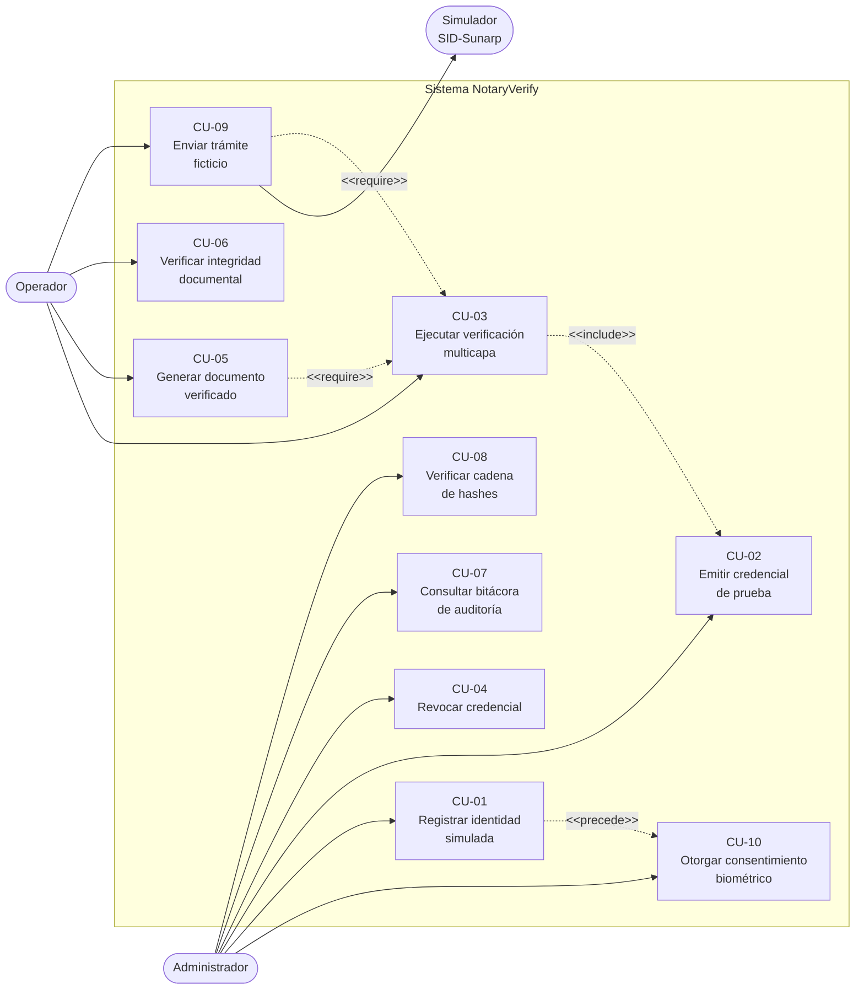

El caso de uso **CU-03 (Ejecutar verificación multicapa)** es el caso de uso arquitectónicamente significativo: atraviesa todas las capas del sistema, involucra a todos los servicios de dominio y determina la estructura de las vistas lógica y de procesos que se describen a continuación.

## 3.2. Vista Lógica

La vista lógica describe la organización estática del sistema: cómo se agrupan las responsabilidades en subsistemas, qué clases las implementan y cómo se persisten los datos.

### 3.2.1. Diagrama de Subsistemas (paquetes)

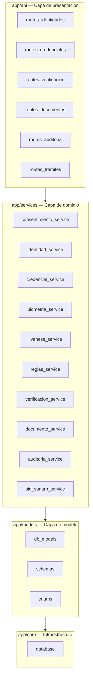

El subsistema `verificacion_service` actúa como **orquestador**: es el único servicio que coordina a varios otros. Los demás servicios mantienen una responsabilidad única y no se invocan entre sí, lo que reduce el acoplamiento y facilita la prueba unitaria de cada uno de forma aislada.

### 3.2.2. Diagrama de Secuencia (vista de diseño)

#### 3.2.2.1. Ejecución de la verificación multicapa (CU-03)

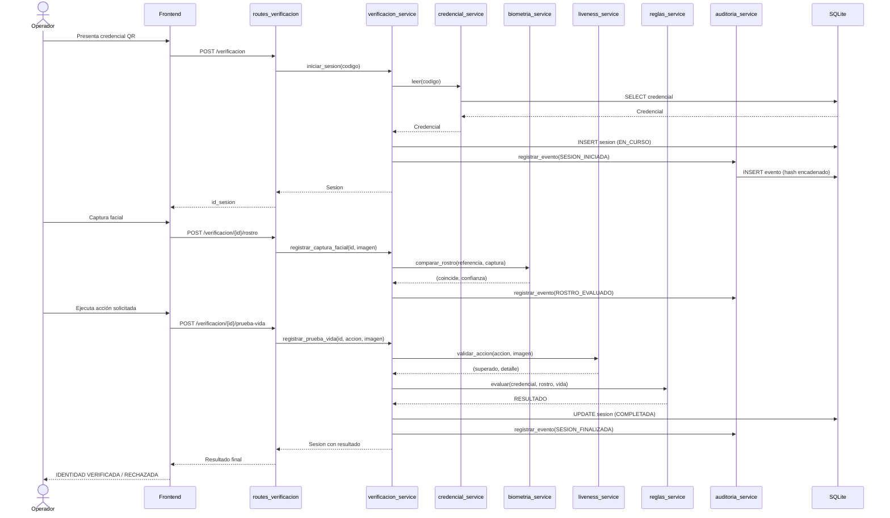

#### 3.2.2.2. Verificación de integridad documental

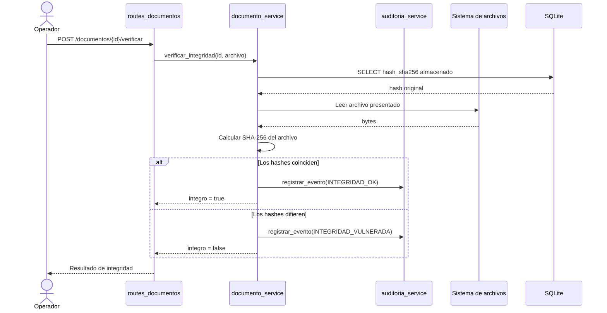

#### 3.2.2.3. Encadenamiento criptográfico de la bitácora

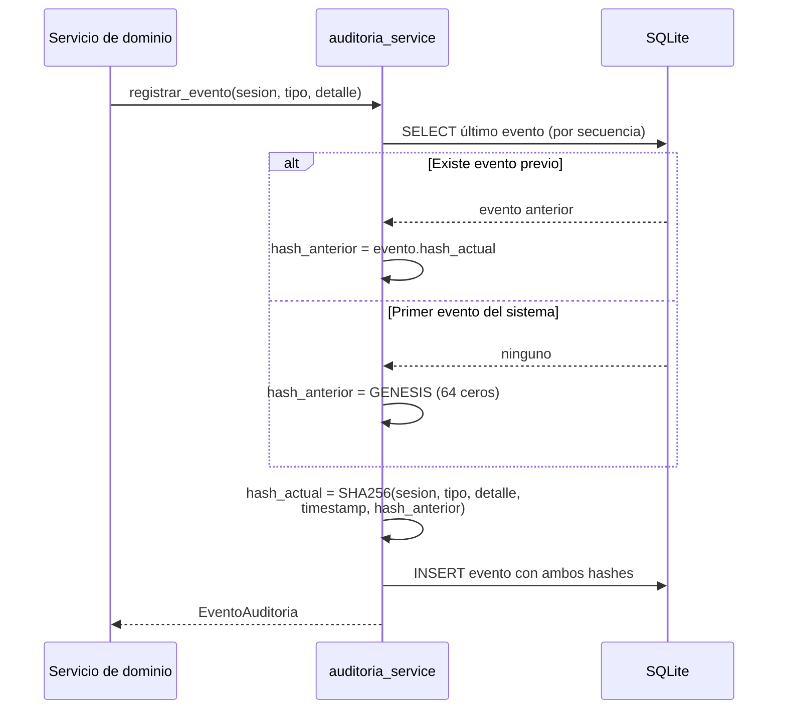

### 3.2.3. Diagrama de Colaboración (vista de diseño)

El diagrama de colaboración presenta las mismas interacciones del caso de uso CU-03, organizadas según la estructura de los objetos participantes en lugar de su secuencia temporal. La numeración indica el orden de los mensajes.

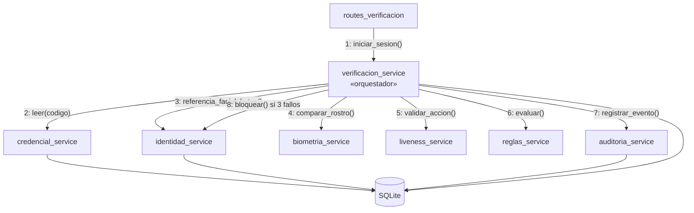

Se observa que `verificacion_service` es el único objeto con múltiples colaboradores. Esta concentración es deliberada: constituye la materialización del objetivo arquitectónico de que la decisión final resida en un solo punto del sistema.

### 3.2.4. Diagrama de Objetos

El siguiente diagrama muestra una instantánea del sistema durante una sesión de verificación aprobada para la identidad ficticia PERSONA-001.

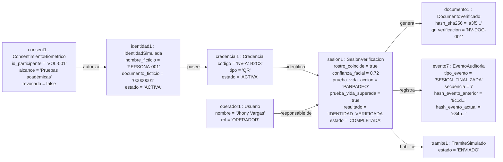

### 3.2.5. Diagrama de Clases

El diagrama refleja las entidades ORM efectivamente implementadas en el módulo `app/models/db_models.py`.

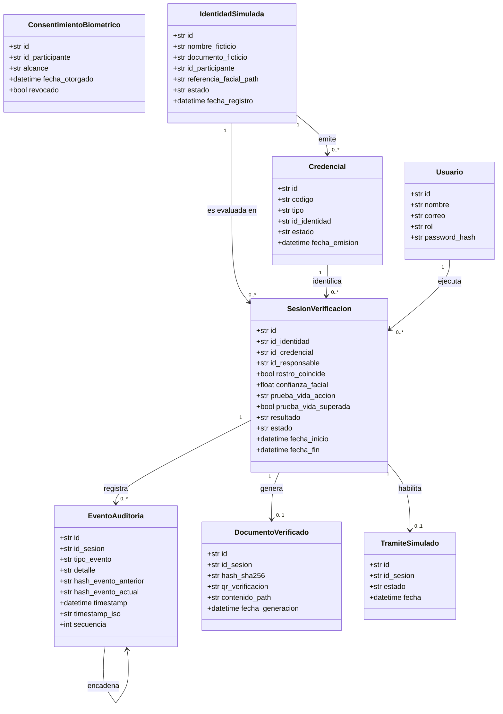

### 3.2.6. Diagrama de Base de datos (relacional)

El sistema persiste sus datos en una base relacional SQLite embebida. El siguiente diagrama entidad-relación refleja el esquema generado por SQLAlchemy.

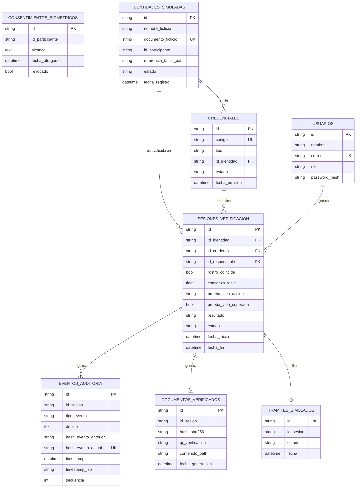

Cabe destacar una decisión de diseño en la tabla `eventos_auditoria`: el campo `timestamp_iso` almacena explícitamente la cadena de texto empleada en el cálculo del hash. Persistirla, en lugar de reconstruirla a partir del campo `timestamp`, garantiza que la verificación de la cadena sea determinista y no dependa de cómo cada motor de base de datos serialice los valores de fecha y hora.

## 3.3. Vista de Implementación (vista de desarrollo)

La vista de implementación describe la organización del código fuente tal como se encuentra en el repositorio del proyecto.

### 3.3.1. Diagrama de arquitectura software (paquetes)

**Nivel 1 — Contexto del sistema**

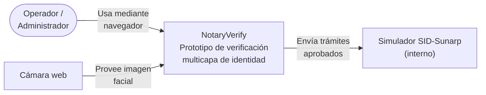

**Nivel 2 — Contenedores**

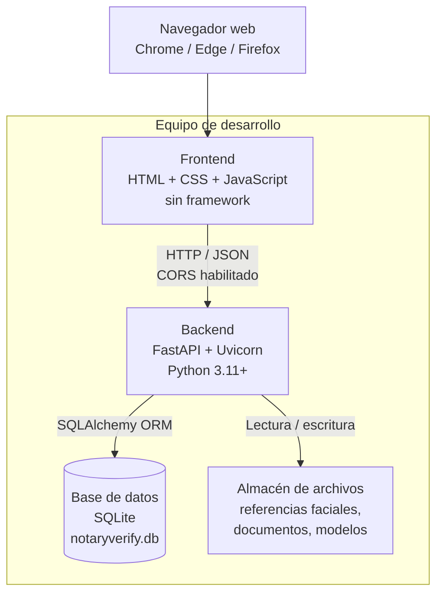

**Nivel 3 — Estructura interna de paquetes**

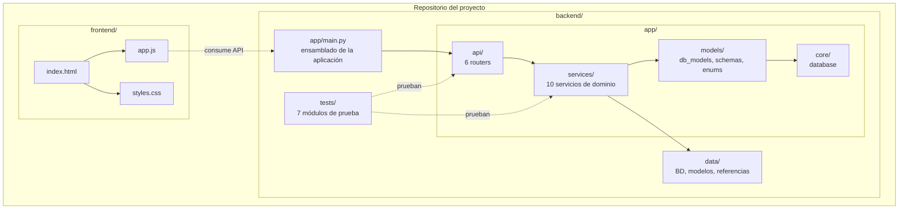

### 3.3.2. Diagrama de arquitectura del sistema (Diagrama de componentes)

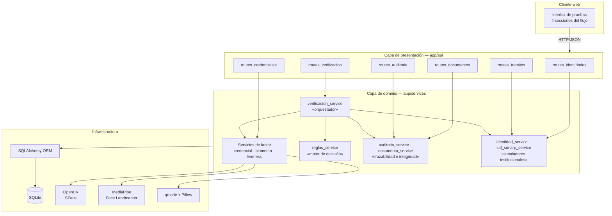

La agrupación de los servicios en cuatro familias —orquestación, factores, decisión y trazabilidad— evidencia la intención arquitectónica: los servicios de factor producen **evidencia**, el motor de reglas produce el **veredicto** y los servicios de trazabilidad producen la **prueba** de lo ocurrido. Ningún componente asume más de una de estas responsabilidades.

## 3.4. Vista de procesos

La vista de procesos describe el comportamiento dinámico del sistema durante la ejecución del caso de uso crítico.

### 3.4.1. Diagrama de Procesos del sistema (diagrama de actividad)

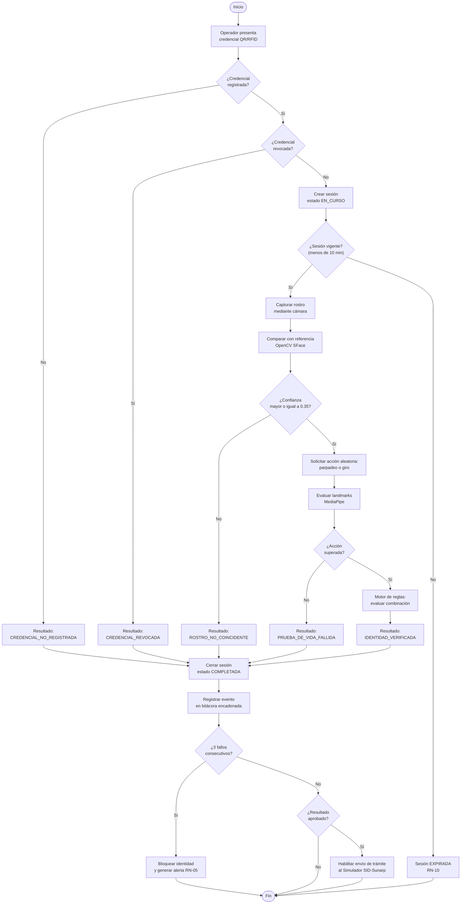

El diagrama evidencia dos características arquitectónicas relevantes. En primer lugar, existen **cinco puntos de salida negativos** antes de alcanzar la aprobación, lo que materializa el principio de que la verificación debe superar todas las capas. En segundo lugar, **todos los caminos convergen** en el registro de la bitácora, garantizando que ningún resultado quede sin traza, incluidos los rechazos.

## 3.5. Vista de Despliegue (vista física)

### 3.5.1. Diagrama de despliegue

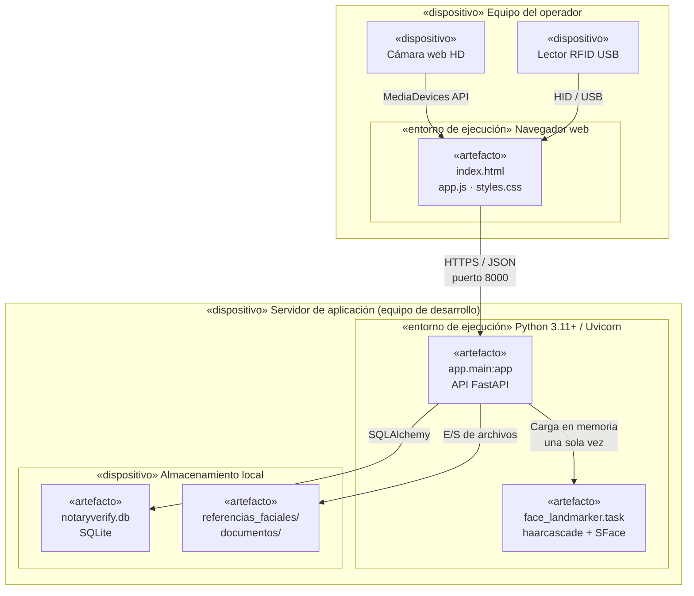

El despliegue es deliberadamente simple. El prototipo se ejecuta sobre un único nodo físico que aloja tanto el servidor de aplicación como el almacenamiento, mientras que el cliente se ejecuta en el navegador del operador. Esta topología es coherente con el carácter experimental del sistema y con la restricción de recursos descrita en la sección 2.2.

Merece mención la decisión de **cargar los modelos biométricos una sola vez** y mantenerlos en memoria entre peticiones. El modelo `face_landmarker.task` de MediaPipe tarda varios segundos en inicializarse; cargarlo en cada petición haría inviable el cumplimiento del requerimiento RNF-02, que exige comparaciones faciales por debajo de los tres segundos.

\pagebreak

# 4. ATRIBUTOS DE CALIDAD DEL SOFTWARE

Los escenarios que se presentan a continuación siguen la estructura propuesta por el Software Engineering Institute (fuente, estímulo, artefacto, entorno, respuesta y medida de respuesta) y constituyen los criterios verificables con los que se evaluará la arquitectura durante la fase de pruebas.

## 4.1. Escenario de Funcionalidad

| Elemento | Descripción |
| :- | :- |
| Fuente | Operador de verificación |
| Estímulo | El operador presenta una credencial QR válida y el participante supera tanto la comparación facial como la prueba de vida |
| Artefacto | Motor de verificación multicapa (`verificacion_service` + `reglas_service`) |
| Entorno | Operación normal, iluminación adecuada y cámara funcional |
| Respuesta | El sistema evalúa los tres factores, registra la sesión con estado COMPLETADA y resultado IDENTIDAD_VERIFICADA, y habilita el envío del trámite al Simulador SID-Sunarp |
| Medida de respuesta | El 100 % de los escenarios legítimos controlados produce el resultado IDENTIDAD_VERIFICADA. Ningún factor por sí solo genera una aprobación |

## 4.2. Escenario de Usabilidad

| Elemento | Descripción |
| :- | :- |
| Fuente | Operador sin experiencia técnica previa |
| Estímulo | El operador debe ejecutar una verificación completa por primera vez |
| Artefacto | Interfaz web de pruebas (`frontend/index.html`) |
| Entorno | Estación de verificación en entorno académico controlado, con posibles distracciones |
| Respuesta | El operador completa el flujo lineal —credencial, captura facial, prueba de vida y resultado— sin asistencia externa, guiado por las cuatro secciones de la interfaz |
| Medida de respuesta | Tasa de éxito mayor o igual al 90 % en la primera sesión. El flujo no supera los cuatro pasos, conforme al requerimiento RNF-01 |

## 4.3. Escenario de Confiabilidad

| Elemento | Descripción |
| :- | :- |
| Fuente | Participante de prueba |
| Estímulo | Durante una sesión en curso, el operador abandona el proceso y transcurren más de diez minutos sin actividad |
| Artefacto | Control de vigencia de sesión (`verificacion_service`, constante `VIGENCIA_SESION`) |
| Entorno | Operación normal con interrupción imprevista |
| Respuesta | El sistema marca la sesión como EXPIRADA, registra el evento correspondiente en la bitácora y rechaza cualquier intento posterior de continuar con esa sesión |
| Medida de respuesta | El 100 % de las sesiones inactivas por más de diez minutos expira correctamente. Ninguna sesión expirada puede reanudarse, conforme a la regla RN-10 |

## 4.4. Escenario de Rendimiento

| Elemento | Descripción |
| :- | :- |
| Fuente | Operador de verificación |
| Estímulo | El operador envía una imagen facial para su comparación con la referencia registrada |
| Artefacto | Módulo de reconocimiento facial (`biometria_service` + OpenCV SFace) |
| Entorno | Equipo de desarrollo estándar, sin aceleración por GPU, con los modelos ya cargados en memoria |
| Respuesta | El sistema detecta el rostro, extrae sus características, calcula la similitud coseno frente a la referencia y devuelve el veredicto junto con la métrica de confianza |
| Medida de respuesta | Latencia promedio inferior a 3 segundos por comparación en 20 intentos consecutivos (RNF-02). El proceso completo de verificación no supera los 45 segundos (RNF-04) |

## 4.5. Escenario de Mantenibilidad

| Elemento | Descripción |
| :- | :- |
| Fuente | Integrante del equipo de desarrollo |
| Estímulo | Es necesario ajustar el umbral de coincidencia facial tras analizar los resultados de los 100 intentos controlados de evaluación |
| Artefacto | Constantes de configuración de `biometria_service` y `liveness_service` |
| Entorno | Entorno de desarrollo, sin usuarios activos |
| Respuesta | El desarrollador modifica la constante `UMBRAL_COINCIDENCIA` en un único punto del código y ejecuta la batería de pruebas automatizadas para confirmar que no se han producido regresiones |
| Medida de respuesta | El cambio se completa en menos de 5 minutos y afecta a un solo archivo. Las pruebas del motor de reglas y del orquestador continúan aprobando sin modificación |

## 4.6. Otros Escenarios

### 4.6.1. Escenario de Seguridad

| Elemento | Descripción |
| :- | :- |
| Fuente | Actor malintencionado con acceso al archivo de base de datos |
| Estímulo | El actor modifica directamente el campo `detalle` de un evento ya registrado en la tabla `eventos_auditoria`, con la intención de ocultar un rechazo previo |
| Artefacto | Bitácora de auditoría con encadenamiento criptográfico (`auditoria_service`) |
| Entorno | Acceso directo al archivo `notaryverify.db`, fuera de la aplicación |
| Respuesta | Al ejecutar la verificación de la cadena, el sistema recalcula el hash del evento alterado, detecta que no coincide con el almacenado y señala la secuencia exacta en la que se rompe la cadena |
| Medida de respuesta | El 100 % de las alteraciones deliberadas es detectado, conforme al requerimiento RNF-10 y a la regla RN-07 |

### 4.6.2. Escenario de Interoperabilidad ante fallos externos

| Elemento | Descripción |
| :- | :- |
| Fuente | Simulador SID-Sunarp |
| Estímulo | El operador envía un trámite ficticio y el servicio externo simulado responde con un escenario de error o de tiempo de espera agotado |
| Artefacto | Módulo de integración simulada (`sid_sunarp_service`) |
| Entorno | Escenario de prueba configurado deliberadamente para representar la indisponibilidad del servicio |
| Respuesta | El sistema registra el trámite con estado ERROR_SERVICIO o TIEMPO_AGOTADO, deja constancia del evento en la bitácora y no altera el resultado de la sesión de verificación ya aprobada |
| Medida de respuesta | El fallo del servicio externo no compromete la integridad de la sesión. El 100 % de los escenarios de error queda registrado y es reproducible |

### 4.6.3. Escenario de Privacidad

| Elemento | Descripción |
| :- | :- |
| Fuente | Administrador del sistema |
| Estímulo | Se intenta registrar una identidad simulada con una fotografía de referencia sin haber otorgado previamente el consentimiento biométrico del participante |
| Artefacto | Servicio de consentimiento (`consentimiento_service`) |
| Entorno | Operación normal de enrolamiento |
| Respuesta | El sistema rechaza el registro y exige el consentimiento expreso y vigente del participante antes de admitir cualquier muestra biométrica |
| Medida de respuesta | Ninguna referencia facial se almacena sin un consentimiento asociado y no revocado, en cumplimiento de la Ley N.° 29733 y su Reglamento |
