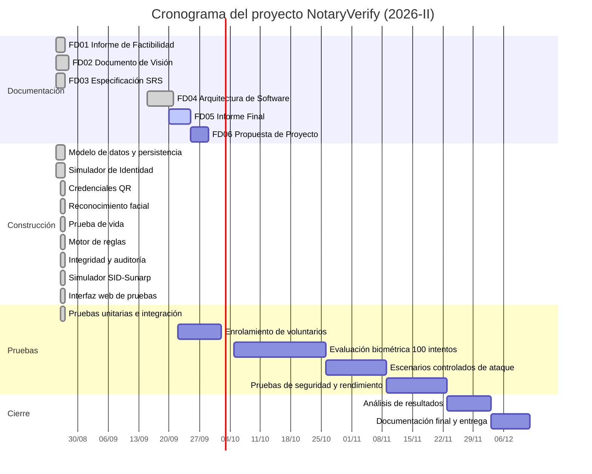

**UNIVERSIDAD PRIVADA DE TACNA**

**FACULTAD DE INGENIERIA**

**Escuela Profesional de Ingeniería de Sistemas**

**Informe Final**

**Proyecto *NotaryVerify — Sistema Experimental de Verificación de Identidad para Trámites Notariales***

Curso: *Calidad y Pruebas de Software*

Docente: *Patrick Jose Cuadros Quiroga*

Integrantes:

***Cohaila Alvarado, Gabriela Estefania (2022075746)***

***Vargas Luque, Jhony (2022075754)***

**Tacna – Perú**

***2026***

\pagebreak

Sistema *NotaryVerify*

Informe Final de Proyecto

Versión *1.0*

|CONTROL DE VERSIONES||||||
| :-: | :- | :- | :- | :- | :- |
|Versión|Hecha por|Revisada por|Aprobada por|Fecha|Motivo|
|1\.0|GC, JV|PJCQ|PJCQ|20/09/2026|Versión Original|

\pagebreak

# **INDICE GENERAL**

1. Antecedentes

2. Planteamiento del Problema

2.1. Problema

2.2. Justificación

2.3. Alcance

3. Objetivos

3.1. Objetivo general

3.2. Objetivos Específicos

4. Marco Teórico

4.1. Suplantación de identidad en el ámbito notarial y registral

4.2. Reconocimiento facial biométrico

4.3. Prueba de vida (liveness detection)

4.4. Integridad documental y encadenamiento criptográfico

5. Desarrollo de la Solución

5.1. Análisis de Factibilidad

5.2. Tecnología de Desarrollo

5.3. Producto obtenido y resultados de las pruebas

6. Cronograma

7. Presupuesto

8. Conclusiones

9. Recomendaciones

10. Bibliografía

Anexos

\pagebreak

**<u>Informe Final de Proyecto</u>**

# 1. Antecedentes

El presente documento constituye el Informe Final del proyecto **NotaryVerify – Sistema Experimental de Verificación de Identidad para Trámites Notariales**, desarrollado por el equipo conformado por Gabriela Estefania Cohaila Alvarado y Jhony Vargas Luque en el marco del curso Calidad y Pruebas de Software de la Escuela Profesional de Ingeniería de Sistemas de la Universidad Privada de Tacna, durante el semestre académico 2026-II.

NotaryVerify es un prototipo académico que implementa un proceso de verificación multicapa de identidad, combinando credenciales electrónicas de prueba, reconocimiento facial local, una prueba de vida experimental, un motor de reglas de seguridad, verificación de integridad documental mediante SHA-256 y una bitácora de auditoría con encadenamiento criptográfico. El sistema opera exclusivamente sobre identidades ficticias y sobre datos biométricos de participantes voluntarios que otorgaron consentimiento expreso.

Este informe consolida el trabajo documentado previamente en los entregables **FD01 (Informe de Factibilidad)**, **FD02 (Documento de Visión)**, **FD03 (Especificación de Requerimientos de Software)** y **FD04 (Documento de Arquitectura de Software)**, e incorpora los resultados obtenidos tras la construcción efectiva del sistema.

A diferencia de un informe elaborado antes del desarrollo, este documento reporta un producto **construido y verificado**: el backend, el frontend y la batería de pruebas automatizadas se encuentran implementados en el repositorio del proyecto, y los resultados de ejecución que se presentan en la sección 5.3 corresponden a mediciones reales y no a estimaciones.

# 2. Planteamiento del Problema

## 2.1. Problema

Las notarías intervienen en la formalización de actos y documentos jurídicos en los que la correcta identificación de las personas constituye un elemento fundamental para brindar seguridad a las operaciones realizadas. Una suplantación de identidad puede permitir que una persona intervenga en un trámite utilizando la identidad de otra, generando posteriormente consecuencias jurídicas, administrativas y registrales de difícil reversión.

La problemática no constituye únicamente un riesgo teórico. En junio de 2026, la Superintendencia Nacional de los Registros Públicos declaró procedente una anotación preventiva notarial sobre una partida del Registro de Predios por una presunta suplantación de identidad relacionada con una escritura pública. Durante el mismo año se emitieron resoluciones de cancelación de asientos registrales por causales vinculadas a falsificación documental, lo que evidencia que la autenticidad de la identidad y de la documentación continúa siendo un aspecto crítico dentro del entorno notarial y registral peruano.

El sistema registral peruano dispone de mecanismos oficiales de seguridad. El Sistema de Intermediación Digital de la Sunarp (SID-Sunarp) permite la presentación electrónica de documentos mediante firma digital y, desde noviembre de 2023, los partes y solicitudes notariales que contienen actos inscribibles deben ser expedidos con firma digital y presentados a través de dicho sistema. Estos mecanismos, sin embargo, operan sobre el **documento** que se presenta al registro, no sobre la **persona física** que comparece ante la notaría en el momento del acto.

Se identifica entonces una brecha: no existe evidencia pública de que las notarías empleen, de forma complementaria a los controles oficiales, una capa adicional de verificación biométrica con prueba de vida como control previo al trámite. La validación basada únicamente en el documento físico presentado no garantiza que la persona que comparece sea su titular legítimo, y la ausencia de un registro estructurado de las verificaciones realizadas dificulta reconstruir qué controles se aplicaron ante un caso posterior de suplantación.

A ello se suma que la dependencia de un único factor de validación resulta insuficiente: un mecanismo comprometido —una fotografía impresa presentada ante una cámara, o una credencial sustraída— puede bastar para habilitar el fraude si no existe un control que exija la concurrencia simultánea de varios factores.

## 2.2. Justificación

El desarrollo de NotaryVerify se justifica por la necesidad de investigar, dentro de un entorno académico controlado, si la combinación de múltiples controles electrónicos y biométricos permite detectar escenarios de suplantación de identidad con mayor eficacia que el uso aislado de un único mecanismo.

Desde la perspectiva **técnica**, el proyecto permite evaluar de forma empírica el comportamiento conjunto de tecnologías de reconocimiento facial local, detección de puntos faciales para prueba de vida, criptografía de integridad y motores de reglas. La ejecución de escenarios controlados de ataque —persona no registrada, rostro incorrecto, fotografía estática, credencial inválida o revocada, documento modificado— proporciona evidencia medible sobre la efectividad de cada capa y de su combinación.

Desde la perspectiva de **calidad de software**, que constituye el eje del curso, el proyecto ofrece un caso de estudio idóneo: un sistema con reglas de negocio precisas y verificables, en el que cada regla puede traducirse en casos de prueba automatizados con resultados deterministas. Esto permite aplicar de forma significativa las prácticas de pruebas unitarias, de integración, de seguridad y de aceptación abordadas en la asignatura.

Desde la perspectiva de **protección de datos**, el proyecto adopta una postura deliberadamente conservadora. El Reglamento de la Ley N.° 29733, aprobado mediante Decreto Supremo N.° 016-2024-JUS, reconoce los datos biométricos como información sensible sujeta a medidas especiales de protección. El uso exclusivo de identidades ficticias y de muestras biométricas de voluntarios con consentimiento expreso permite desarrollar y evaluar el sistema sin tratar información real de ciudadanos, convirtiendo la restricción normativa en una decisión de diseño verificable.

Desde la perspectiva **institucional**, el prototipo no compite con los mecanismos oficiales ni pretende sustituirlos. Se plantea como una capa complementaria de verificación previa, cuyos resultados pueden servir de base para investigaciones posteriores o para una eventual propuesta piloto ante una notaría, una vez validado el enfoque experimental.

## 2.3. Alcance

El alcance del proyecto abarca el desarrollo, la implementación y la evaluación de un prototipo experimental de verificación multicapa de identidad, operando exclusivamente sobre identidades ficticias y datos biométricos autorizados.

**Dentro del alcance del proyecto se considera:**

- Desarrollo de una API REST que implemente el Simulador de Identidad, la gestión de credenciales de prueba, el motor de verificación multicapa, la integridad documental y la bitácora de auditoría.
- Desarrollo de una interfaz web de pruebas que permita ejecutar el flujo completo de verificación sin conocimientos técnicos avanzados.
- Implementación de reconocimiento facial local mediante OpenCV, evitando servicios biométricos comerciales de pago.
- Implementación de una prueba de vida experimental mediante desafíos faciales aleatorios evaluados con MediaPipe Face Landmarker.
- Implementación de un motor de reglas que exija la concurrencia de credencial válida, rostro coincidente y prueba de vida superada.
- Implementación de integridad documental mediante SHA-256 y de una bitácora de auditoría con encadenamiento criptográfico.
- Implementación de un Simulador SID-Sunarp con escenarios configurables de disponibilidad, rechazo y error de servicio.
- Automatización de pruebas sobre la lógica crítica del sistema.

**Fuera del alcance del proyecto se considera:**

- La integración real con Reniec, el SID-Sunarp oficial, la firma digital oficial o cualquier sistema gubernamental de identificación.
- El uso de información personal o biométrica real de clientes de una notaría.
- Cualquier valor de identificación legal. Un resultado IDENTIDAD VERIFICADA significa únicamente que la persona superó los mecanismos experimentales configurados en el prototipo.
- La integración con lectores RFID físicos. El sistema modela el tipo de credencial RFID, pero la lectura se realiza mediante el ingreso del código de credencial, sin controlador de hardware.
- El despliegue en producción ante una notaría real o la comercialización del sistema.
- El proyecto se ejecuta entre el **25 de agosto de 2026 y el 12 de diciembre de 2026**, con una inversión estimada de **S/. 9,573.32**, cubierta con recursos propios del equipo.

# 3. Objetivos

## 3.1. Objetivo general

Desarrollar y validar un sistema experimental de verificación multicapa de identidad para trámites notariales simulados que combine credenciales electrónicas, reconocimiento facial local, prueba de vida, reglas de seguridad, verificación de integridad y auditoría criptográfica, utilizando exclusivamente identidades ficticias y datos biométricos autorizados, con el fin de analizar su efectividad para detectar intentos controlados de suplantación de identidad.

## 3.2. Objetivos Específicos

- **Implementar el Simulador de Identidad:** construir una API propia que permita registrar y consultar identidades ficticias con documento, nombres, fotografía de referencia y estado, sin utilizar información procedente de Reniec.

- **Implementar el mecanismo de credenciales de prueba:** generar credenciales QR asociadas a identidades simuladas, garantizando que su lectura únicamente identifique el registro a verificar y que la credencial por sí sola no apruebe una identidad.

- **Implementar el reconocimiento facial local y la prueba de vida:** comparar el rostro capturado con la referencia registrada produciendo una métrica de confianza, y validar acciones faciales aleatorias como el parpadeo o el giro del rostro.

- **Implementar el motor de verificación multicapa:** combinar los factores de seguridad de modo que ningún factor aislado resulte suficiente, y rechazar automáticamente los escenarios que incumplan las reglas establecidas.

- **Implementar los mecanismos de trazabilidad:** calcular y verificar la integridad documental mediante SHA-256, y registrar las operaciones críticas en una bitácora con encadenamiento criptográfico que permita detectar alteraciones posteriores.

- **Automatizar las pruebas de la lógica crítica:** construir una batería de pruebas que cubra el motor de reglas, el flujo de credenciales, la integridad documental, la bitácora y el orquestador de verificación.

# 4. Marco Teórico

## 4.1. Suplantación de identidad en el ámbito notarial y registral

La suplantación de identidad consiste en la utilización de la identidad de una persona por parte de otra, con el propósito de obtener un beneficio o de producir efectos jurídicos que no corresponderían al suplantador. En el ámbito notarial, este fenómeno adquiere particular gravedad porque los actos formalizados ante notario gozan de fe pública y producen efectos registrales que afectan derechos de terceros.

El ordenamiento peruano ha incorporado progresivamente mecanismos de seguridad orientados a mitigar este riesgo. La obligatoriedad de la firma digital para los partes notariales con actos inscribibles, establecida por la Superintendencia Nacional de los Registros Públicos en 2023, fortalece la autenticidad del documento presentado al registro. No obstante, estos mecanismos actúan sobre el soporte documental y sobre la identidad del notario que lo expide, no sobre la verificación biométrica del compareciente en el momento del acto.

La literatura sobre seguridad de la identidad distingue tres factores de autenticación: algo que se sabe (una contraseña), algo que se tiene (una credencial) y algo que se es (un rasgo biométrico). La autenticación multifactor se fundamenta en que el compromiso de un único factor no debe bastar para acreditar una identidad. NotaryVerify traslada este principio al contexto notarial, combinando un factor de posesión —la credencial de prueba— con un factor inherente —el rostro— y una verificación de presencia física —la prueba de vida.

## 4.2. Reconocimiento facial biométrico

El reconocimiento facial es una técnica biométrica que identifica o verifica a una persona a partir de las características geométricas y texturales de su rostro. El proceso comprende tres etapas: la detección del rostro dentro de la imagen, la extracción de un vector de características que lo representa numéricamente, y la comparación de ese vector con una referencia previamente registrada.

La comparación no produce un resultado binario, sino una **métrica de similitud** que debe contrastarse con un umbral de decisión. La elección de ese umbral determina el equilibrio entre dos tipos de error: los falsos positivos, en los que el sistema acepta a una persona que no es la titular, y los falsos negativos, en los que rechaza a la persona legítima. Un umbral más exigente reduce los falsos positivos a costa de incrementar los falsos negativos, y viceversa.

En NotaryVerify se emplea el modelo **SFace**, disponible en el repositorio OpenCV Zoo, que produce una medida de similitud coseno entre los vectores de características de dos rostros. El sistema adopta un umbral de coincidencia de **0.35**, valor parametrizado en una única constante del módulo de biometría, de modo que pueda ajustarse tras el análisis de los resultados experimentales sin modificar la lógica del sistema.

## 4.3. Prueba de vida (liveness detection)

La comparación entre dos imágenes faciales presenta una vulnerabilidad conocida como **ataque de presentación**: un atacante puede intentar engañar al sistema mostrando una fotografía impresa, una imagen desplegada en la pantalla de otro dispositivo o un video pregrabado. Dado que el vector de características extraído de una fotografía de un rostro puede ser muy similar al del rostro real, el reconocimiento facial por sí solo no distingue entre una persona presente y su representación.

La prueba de vida agrupa las técnicas destinadas a verificar que el rostro presentado corresponde a una persona físicamente presente. Se distinguen dos enfoques: los **pasivos**, que analizan propiedades de la imagen como la textura de la piel o el reflejo de la luz, y los **activos**, que solicitan al usuario la ejecución de una acción y verifican su cumplimiento.

NotaryVerify implementa un enfoque **activo basado en desafíos aleatorios**. El sistema solicita una acción seleccionada al azar —parpadear, girar el rostro hacia la izquierda o hacia la derecha— y evalúa su cumplimiento mediante los puntos de referencia faciales detectados por MediaPipe Face Landmarker. La aleatoriedad del desafío es esencial: impide que un atacante prepare material anticipadamente, dado que desconoce qué acción le será solicitada.

Para la detección del parpadeo se emplea el **Eye Aspect Ratio (EAR)**, relación geométrica entre las distancias verticales y horizontales de los puntos del contorno ocular. El EAR disminuye de forma pronunciada cuando el ojo se cierra; el sistema considera superado el desafío de parpadeo cuando el valor cae por debajo de **0.21**. Para los giros del rostro se evalúa el desplazamiento relativo de la punta de la nariz respecto a las mejillas, con un umbral de **0.15**.

Cabe precisar que este mecanismo constituye una prueba de vida **experimental** y no pretende equipararse a los sistemas biométricos certificados empleados por instituciones públicas.

## 4.4. Integridad documental y encadenamiento criptográfico

Una función hash criptográfica transforma un conjunto arbitrario de datos en una cadena de longitud fija que actúa como su huella digital. **SHA-256** produce una salida de 256 bits y posee dos propiedades relevantes para este proyecto: es determinista, de modo que el mismo contenido produce siempre el mismo hash, y presenta el efecto avalancha, por el cual una modificación mínima del contenido genera un hash completamente distinto. Estas propiedades permiten detectar si un documento fue alterado tras su registro: basta recalcular su hash y compararlo con el almacenado.

El **encadenamiento criptográfico** (hash chain) extiende este principio a una secuencia de registros. Cada elemento de la cadena incorpora, entre los datos de los que se calcula su hash, el hash del elemento inmediatamente anterior. De este modo, la alteración de un registro intermedio modifica su propio hash, que deja de coincidir con el valor referenciado por el registro siguiente, rompiendo la cadena desde ese punto en adelante.

Esta estructura, empleada como fundamento en las tecnologías de registro distribuido, se aplica en NotaryVerify a la bitácora de auditoría. El primer evento del sistema se enlaza con un hash génesis convencional de sesenta y cuatro ceros, y cada evento posterior incorpora el hash del anterior. La propiedad resultante es que **ningún evento puede modificarse retroactivamente sin que la verificación de la cadena lo detecte**, lo que proporciona garantía de no repudio sobre el historial de verificaciones realizadas.

# 5. Desarrollo de la Solución

## 5.1. Análisis de Factibilidad

### 5.1.1. Factibilidad Técnica

| Aspecto | Detalle |
| :- | :- |
| Equipos de desarrollo | El equipo cuenta con laptops propias, suficientes para el desarrollo del backend, el frontend y las pruebas del modelo de reconocimiento facial. |
| Hardware adicional | Se requiere una cámara web HD y un lector RFID USB, ambos de bajo costo y de fácil adquisición en el mercado local de Tacna. |
| Infraestructura de red | Conexión a internet doméstica o universitaria suficiente. No se requiere infraestructura de red especializada. |
| Software y librerías | Se emplean exclusivamente herramientas de código abierto —Python, FastAPI, SQLAlchemy, OpenCV, MediaPipe—, sin licencias comerciales. |
| Competencias del equipo | Los integrantes poseen conocimientos en desarrollo web, bases de datos y procesamiento de imágenes, adquiridos en asignaturas previas. |

### 5.1.2. Factibilidad Económica

| Categoría | Costo Total (S/.) |
| :- | :-: |
| Costos Generales (hardware y equipos) | 290.00 |
| Costos Operativos (servicios durante el desarrollo) | 23.32 |
| Costos del Ambiente | 60.00 |
| Costos de Personal (equipo del proyecto) | 9,200.00 |
| **Total General** | **9,573.32** |

### 5.1.3. Factibilidad Operativa

| Aspecto | Descripción | Estado |
| :- | :- | :-: |
| Usuarios finales | Estudiantes y voluntarios con conocimientos básicos de informática ejecutan el flujo de verificación. La interfaz presenta el proceso como cuatro pasos secuenciales. | viable |
| Panel de auditoría | Permite consultar sesiones, resultados y bitácora sin conocimientos técnicos avanzados. | viable |
| Capacitación | Se realiza una sesión breve de inducción a los participantes voluntarios antes de las pruebas biométricas. | planificada |
| Soporte técnico | El equipo del proyecto brinda soporte durante todo el periodo de pruebas académicas. | planificado |
| Alcance experimental | El sistema no sustituye a Reniec, al SID-Sunarp ni a la firma digital oficial; opera únicamente sobre identidades y trámites simulados. | delimitado |

### 5.1.4. Factibilidad Social

- **Fortalecimiento de la confianza:** el proyecto aporta evidencia sobre mecanismos que pueden reducir el riesgo percibido de suplantación en trámites notariales.
- **ODS 16 – Paz, Justicia e Instituciones Sólidas:** contribuye a instituciones más transparentes y seguras frente al fraude documental e identitario.
- **ODS 9 – Industria, Innovación e Infraestructura:** introduce innovación tecnológica —biometría y criptografía— en un proceso tradicionalmente manual.
- **Valor académico:** constituye una base para investigación futura sobre verificación de identidad aplicada al sector notarial y registral peruano.
- **Protección de los participantes:** el diseño exige consentimiento expreso previo al tratamiento de cualquier muestra biométrica, práctica trasladable a proyectos posteriores.

### 5.1.5. Factibilidad Legal

- **Ley N.° 29733, Ley de Protección de Datos Personales**, y su Reglamento aprobado por D.S. N.° 016-2024-JUS: reconocen los datos biométricos como información sensible. El proyecto cumple al operar exclusivamente con identidades ficticias y con muestras de voluntarios que otorgaron consentimiento expreso, registrado como entidad del sistema.
- **Independencia de los sistemas oficiales:** el proyecto no sustituye a Reniec, al SID-Sunarp, a la firma digital oficial (Res. N.° 169-2023-SUNARP/SN) ni a los procedimientos notariales legalmente establecidos.
- **Ausencia de valor legal:** los resultados producidos por el sistema no tienen valor de identificación legal, advertencia incorporada de forma explícita en la descripción de la API y en la documentación del proyecto.
- **Propiedad intelectual:** el código fuente es propiedad de los integrantes del proyecto para fines académicos.

### 5.1.6. Factibilidad Ambiental

- **Reducción del uso de papel:** la digitalización de la verificación y de su evidencia reduce la dependencia de copias físicas de documentos.
- **Bajo consumo energético:** el hardware utilizado —cámara web y lector RFID— presenta un consumo mínimo.
- **Ausencia de residuos electrónicos significativos:** el proyecto reutiliza los equipos existentes de los integrantes, sin requerir la adquisición de infraestructura adicional.
- **Procesamiento local:** al ejecutar la inferencia biométrica en el equipo local en lugar de en servicios en la nube, se evita el consumo energético asociado al procesamiento remoto y a la transferencia de datos.

## 5.2. Tecnología de Desarrollo

| Capa | Tecnología | Justificación |
| :- | :- | :- |
| Backend / API | Python 3.11+ con FastAPI | Genera documentación interactiva automática (OpenAPI/Swagger), valida la entrada mediante anotaciones de tipo y ofrece un rendimiento adecuado para el prototipo. Python concentra además el ecosistema de visión por computadora requerido. |
| Persistencia | SQLite con SQLAlchemy | Base de datos embebida que no requiere servidor ni administración, coherente con la restricción de recursos. SQLAlchemy abstrae el acceso a datos y permitiría migrar a otro motor sin reescribir la lógica de dominio. |
| Validación de datos | Pydantic | Define los esquemas de entrada y salida de la API de forma declarativa, con validación automática y mensajes de error precisos. |
| Reconocimiento facial | OpenCV con modelo SFace | Biblioteca de código abierto, sin costo de licencia ni dependencia de APIs de pago. Ejecuta la inferencia localmente, lo que evita transmitir datos biométricos por la red. |
| Prueba de vida | MediaPipe Face Landmarker | Detecta con precisión los puntos de referencia faciales necesarios para evaluar el parpadeo y los giros del rostro, con rendimiento adecuado en CPU. |
| Generación de QR | qrcode con Pillow | Genera los códigos de las credenciales de prueba y de verificación documental sin servicios externos. |
| Frontend | HTML, CSS y JavaScript sin framework | Elimina el proceso de compilación y las dependencias de terceros, garantizando compatibilidad con Chrome, Edge y Firefox y facilitando la continuidad académica del proyecto. |
| Pruebas | pytest | Permite expresar los casos de prueba de forma concisa y parametrizada, lo que resulta especialmente adecuado para verificar las combinaciones del motor de reglas. |
| Control de versiones | Git y GitHub | Repositorio alojado en la organización académica, con separación entre la rama de código y la rama de documentación. |

## 5.3. Producto obtenido y resultados de las pruebas

### 5.3.1. Producto construido

El sistema se encuentra implementado y operativo. Sus magnitudes son las siguientes:

| Componente | Magnitud |
| :- | :-: |
| Código del backend (`backend/app`) | 1,536 líneas |
| Pruebas automatizadas (`backend/tests`) | 387 líneas |
| Interfaz web (`frontend`) | 670 líneas |
| **Total de código fuente** | **2,593 líneas** |
| Endpoints REST expuestos | 15 |
| Servicios de dominio | 10 |
| Entidades persistidas | 8 |

La estructura responde a la arquitectura en capas documentada en el FD04: la capa de API expone los endpoints y traduce las excepciones de dominio; la capa de servicios concentra la lógica de negocio sin conocer HTTP; la capa de modelo define las entidades y esquemas; y la capa de infraestructura gestiona la persistencia.

### 5.3.2. Resultados de la batería de pruebas

Se ejecutó la batería completa de pruebas automatizadas sobre el sistema construido. El resultado fue el siguiente:

| Indicador | Resultado |
| :- | :-: |
| Pruebas ejecutadas | 27 |
| Pruebas aprobadas | 27 |
| Pruebas fallidas | 0 |
| Tiempo total de ejecución | 6.36 segundos |
| Entorno | Python 3.14.4, pytest 9.1.1 |

La distribución de las pruebas por módulo y la regla de negocio que verifica cada uno se detalla a continuación:

| Módulo de prueba | Casos | Verifica |
| :- | :-: | :- |
| `test_reglas_service` | 8 | Motor de reglas multicapa (RN-01): cubre los seis resultados documentados y comprueba la precedencia entre factores. |
| `test_auditoria_hashchain` | 4 | Bitácora con encadenamiento criptográfico (RN-07): enlace con el hash génesis, validez de la cadena y detección de alteraciones deliberadas. |
| `test_credencial_flujo` | 4 | Flujo de credenciales (RN-02 a RN-04): consentimiento previo obligatorio, confirmación de dato ficticio, detección de credencial revocada y unicidad del código. |
| `test_verificacion_flow` | 4 | Orquestador de verificación (CU-03, RN-05): credencial no registrada, credencial revocada, registro en bitácora y bloqueo tras tres intentos fallidos. |
| `test_documento_integridad` | 3 | Integridad documental (RN-08): documento íntegro, documento modificado y ausencia de datos personales en el QR de verificación. |
| `test_biometria_liveness` | 2 | Comparación facial y evaluación de la prueba de vida. |
| `test_api_smoke` | 2 | Disponibilidad del endpoint de estado y generación correcta del esquema OpenAPI. |

Resultan particularmente relevantes tres verificaciones. La prueba `test_detecta_alteracion_deliberada_de_un_evento` modifica intencionadamente un evento ya registrado en la bitácora y confirma que la verificación de la cadena detecta la manipulación, validando empíricamente el mecanismo descrito en la sección 4.4. La prueba `test_tres_intentos_fallidos_consecutivos_bloquean_la_identidad_rn05` comprueba que el sistema bloquea la identidad y genera la alerta correspondiente tras tres rechazos consecutivos. Y el conjunto parametrizado de `test_reglas_service` recorre las seis combinaciones posibles de factores, verificando que ninguna aprobación se produce sin la concurrencia de credencial válida, rostro coincidente y prueba de vida superada.

### 5.3.3. Estado de cumplimiento de los objetivos

| Objetivo específico | Estado |
| :- | :- |
| Simulador de Identidad | Implementado y verificado |
| Credenciales de prueba QR | Implementado y verificado |
| Reconocimiento facial local | Implementado y verificado |
| Prueba de vida experimental | Implementado y verificado |
| Motor de verificación multicapa | Implementado y verificado |
| Integridad documental SHA-256 | Implementado y verificado |
| Bitácora con encadenamiento criptográfico | Implementado y verificado |
| Simulador SID-Sunarp | Implementado |
| Automatización de pruebas de lógica crítica | Implementado (27 casos) |
| Evaluación biométrica con 100 intentos controlados | **Pendiente** — programada para la fase de evaluación |
| Integración con lector RFID físico | **Pendiente** — el tipo de credencial está modelado, sin controlador de hardware |
| Control de acceso basado en roles | **Parcial** — la entidad `Usuario` con rol está modelada; el flujo de autenticación no está cableado a los endpoints |

# 6. Cronograma

El proyecto se ejecuta entre el 25 de agosto y el 12 de diciembre de 2026. El siguiente diagrama presenta la planificación por fases:

Al **20 de septiembre de 2026**, fecha de elaboración de este informe, se encuentran completadas las fases de construcción y de pruebas automatizadas, así como los entregables FD01 a FD04. La fase de evaluación biométrica con participantes voluntarios constituye el trabajo restante más significativo.

# 7. Presupuesto

El presupuesto del proyecto asciende a **S/. 9,573.32**, cubierto íntegramente con recursos propios del equipo. El siguiente cuadro presenta la proyección del flujo de caja bajo el escenario hipotético de adopción evaluado en el FD01:

| Periodo | Beneficios (S/.) | Costos Operativos (S/.) | Flujo Neto (S/.) |
| :- | :-: | :-: | :-: |
| Año 0 (Inversión) | 0.00 | 9,573.32 | -9,573.32 |
| Año 1 | 5,800.00 | 1,210.00 | 4,590.00 |
| Año 2 | 5,800.00 | 1,210.00 | 4,590.00 |
| Año 3 | 5,800.00 | 1,210.00 | 4,590.00 |
| **VAN (COK = 12 %)** | | | **S/. 1,451.08** |

Los indicadores financieros del escenario evaluado son los siguientes:

| Indicador | Valor | Criterio | Resultado |
| :- | :-: | :-: | :- |
| Relación Beneficio/Costo (B/C) | 1.82 | B/C > 1 | Aceptado |
| Valor Actual Neto (VAN) | S/. 1,451.08 | VAN > 0 | Aceptado |
| Tasa Interna de Retorno (TIR) | 20.65 % | TIR > COK (12 %) | Aceptado |

Debe precisarse que estos indicadores corresponden a un **escenario hipotético** en el que una notaría adoptara el sistema. Al tratarse de un prototipo académico, el proyecto no genera ingresos reales durante el periodo de ejecución; el análisis se incluye para evaluar la viabilidad de una eventual continuidad del desarrollo más allá del ámbito del curso.

# 8. Conclusiones

1. **El prototipo fue construido y verificado satisfactoriamente.** NotaryVerify se encuentra implementado con 2,593 líneas de código fuente distribuidas entre un backend de 15 endpoints REST y una interfaz web de pruebas. La batería de 27 pruebas automatizadas se ejecuta completa en 6.36 segundos sin fallos, cubriendo el motor de reglas, la bitácora con encadenamiento criptográfico, la integridad documental, el flujo de credenciales y el orquestador de verificación.

2. **La premisa arquitectónica central quedó verificada empíricamente.** Las pruebas parametrizadas del motor de reglas confirman que ninguna combinación de factores produce una aprobación sin la concurrencia simultánea de credencial válida, rostro coincidente y prueba de vida superada. Una credencial válida con rostro no coincidente se rechaza, y una coincidencia facial con prueba de vida fallida también. La separación de cada factor en un servicio independiente, con la decisión concentrada en un único motor de reglas, demostró ser una estructura adecuada para garantizar esta propiedad.

3. **El encadenamiento criptográfico de la bitácora detecta alteraciones de forma efectiva.** La prueba que modifica deliberadamente un evento ya registrado confirma que la verificación de la cadena identifica la manipulación y señala el punto exacto de ruptura. Esto proporciona al prototipo una garantía de no repudio sobre el historial de verificaciones realizadas.

4. **La arquitectura en capas facilitó la verificación del sistema.** La ausencia de dependencias entre los servicios de factor permitió probar cada mecanismo de forma aislada, y la concentración de la lógica de decisión en un módulo de 34 líneas hizo posible cubrir exhaustivamente sus combinaciones mediante pruebas parametrizadas. La decisión de mantener la capa de dominio independiente de HTTP resultó determinante para esta facilidad de prueba.

5. **El proyecto cumple el marco normativo de protección de datos.** El sistema opera exclusivamente sobre identidades ficticias y exige el registro previo de un consentimiento expreso antes de admitir cualquier muestra biométrica, requisito verificado por la prueba `test_no_se_puede_registrar_identidad_sin_consentimiento_previo`. No se ha utilizado información real de ciudadanos en ninguna etapa del desarrollo.

6. **El alcance fue cumplido parcialmente en tres aspectos, que quedan documentados.** La evaluación biométrica con al menos cien intentos controlados se encuentra programada para la fase de evaluación y constituye el trabajo restante más significativo. La integración con lectores RFID físicos quedó modelada pero no implementada a nivel de hardware. El control de acceso basado en roles está modelado en la entidad `Usuario` pero no cableado a los endpoints. Estas limitaciones no comprometen la validez de los resultados obtenidos sobre la efectividad de la verificación multicapa.

7. **El escenario financiero hipotético resulta favorable.** Los tres indicadores respaldan una eventual continuidad del desarrollo: B/C = 1.82 (> 1), VAN = S/. 1,451.08 (> 0) y TIR = 20.65 % (> COK 12 %). No obstante, estos valores corresponden a supuestos de adopción y no a ingresos reales del proyecto académico.

# 9. Recomendaciones

- **Completar la evaluación biométrica antes del cierre del semestre.** Ejecutar los cien intentos controlados distribuidos entre usuarios legítimos y escenarios de suplantación, registrando las tasas de aceptación, rechazo, falsos positivos y falsos negativos. Este conjunto de datos constituye la evidencia central para responder a la pregunta de investigación del proyecto.

- **Ajustar el umbral de coincidencia facial con base en los datos experimentales.** El valor actual de 0.35 fue adoptado como punto de partida. Tras obtener las tasas de error reales, conviene analizar la curva de compromiso entre falsos positivos y falsos negativos y documentar la justificación del umbral final, dado que este parámetro determina directamente el comportamiento del sistema.

- **Cablear el control de acceso basado en roles.** La entidad `Usuario` con rol está modelada y las sesiones registran al responsable, pero los endpoints no exigen autenticación. Completar este mecanismo permitiría satisfacer plenamente el requerimiento RNF-06 y habilitaría la evaluación de los escenarios de seguridad definidos en el FD04.

- **Documentar las limitaciones de la prueba de vida con evidencia experimental.** Ejecutar los escenarios de persona real, fotografía impresa y fotografía mostrada en pantalla, y documentar tanto los resultados como los casos en que el mecanismo no logra discriminar. Reportar las limitaciones con honestidad fortalece el valor académico del trabajo.

- **Incorporar la medición de cobertura de código.** La batería de pruebas es sólida en cuanto a reglas de negocio, pero el proyecto no dispone actualmente de una herramienta de medición de cobertura instalada. Añadir `pytest-cov` permitiría verificar el objetivo del 80 % establecido en el FD02 y detectar rutas de código no ejercitadas.

- **Mantener la separación entre las ramas de código y de documentación.** La organización actual del repositorio, con el código en `main` y los entregables en `documentos`, ha demostrado ser adecuada. Se recomienda sincronizar mediante `git fetch` antes de editar los documentos compartidos, a fin de evitar la pérdida de trabajo por ediciones concurrentes.

- **Evaluar la continuidad del proyecto como investigación aplicada.** Los resultados obtenidos pueden servir de base para una propuesta piloto ante una notaría o para un trabajo de investigación posterior, siempre bajo la precisión de que el sistema no sustituye a los mecanismos oficiales de identificación.

# 10. Bibliografía

Congreso de la República del Perú. (2011). *Ley N.° 29733 — Ley de Protección de Datos Personales*. Lima, Perú.

Google. (2026). *MediaPipe Face Landmarker*. Google AI for Developers.

ISO/IEC. (2011). *ISO/IEC 25010:2011 — Systems and software engineering — SQuaRE*.

Kruchten, P. (1995). Architectural Blueprints — The "4+1" View Model of Software Architecture. *IEEE Software*, 12(6), 42–50.

Ministerio de Justicia y Derechos Humanos. (2024). *Decreto Supremo N.° 016-2024-JUS: Reglamento de la Ley N.° 29733, Ley de Protección de Datos Personales*. Gobierno del Perú.

OpenCV. (2026). *FaceRecognizerSF*. OpenCV Documentation.

OpenCV. (2026). *OpenCV Zoo: SFace Face Recognition Model*.

Pressman, R. S. (2014). *Ingeniería del Software: Un Enfoque Práctico* (8.ª ed.). McGraw-Hill.

Sommerville, I. (2016). *Ingeniería de Software* (10.ª ed.). Pearson Educación.

Superintendencia Nacional de los Registros Públicos. (2023). *Resolución de la Superintendencia Nacional de los Registros Públicos N.° 169-2023-SUNARP/SN*. Gobierno del Perú.

Superintendencia Nacional de los Registros Públicos. (2026a). *Resolución Jefatural N.° 055-2026-SUNARP/ZRXII/JEF*. Gobierno del Perú.

Superintendencia Nacional de los Registros Públicos. (2026b). *Resoluciones relacionadas con cancelación de asientos registrales por falsificación documental*. Gobierno del Perú.

\pagebreak

# Anexos

**Anexo 01 — Informe de Factibilidad.** Documento FD01, que contiene la descripción del proyecto, el análisis de riesgos, el estudio de factibilidad en sus seis dimensiones y el análisis financiero con los indicadores B/C, VAN y TIR.

**Anexo 02 — Documento de Visión.** Documento FD02, que contiene el posicionamiento del producto, la descripción de interesados y usuarios, las veinte características del producto, las doce restricciones y los rangos de calidad.

**Anexo 03 — Documento SRS.** Documento FD03, Especificación de Requerimientos de Software, que contiene los requerimientos funcionales y no funcionales, las reglas de negocio, los casos de uso y los diagramas UML de análisis y diseño.

**Anexo 04 — Documento SAD.** Documento FD04, Documento de Arquitectura de Software, que describe la arquitectura del sistema mediante el modelo de vistas 4+1 y especifica los escenarios de atributos de calidad.

**Anexo 05 — Código fuente y manuales.** Repositorio del proyecto alojado en la organización académica UPT-FAING-EPIS, con el código en la rama `main` y los entregables documentales en la rama `documentos`. Incluye las instrucciones de instalación y ejecución en los archivos `README.md` del backend y del frontend.
