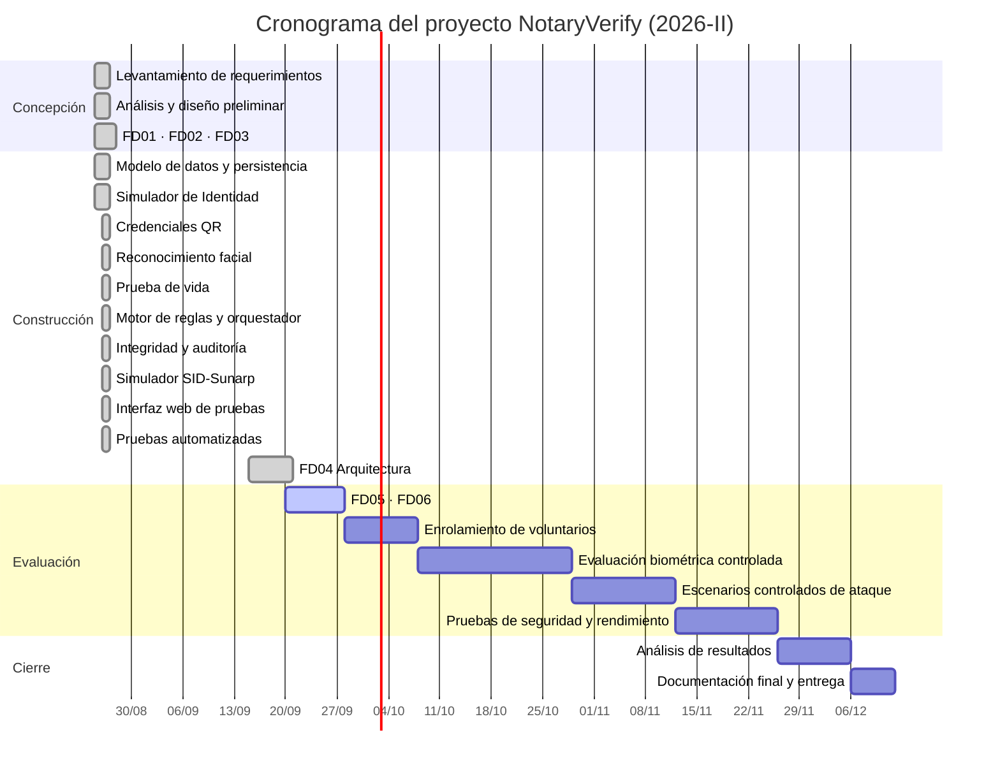

**UNIVERSIDAD PRIVADA DE TACNA**

**FACULTAD DE INGENIERIA**

**Escuela Profesional de Ingeniería de Sistemas**

**Propuesta del Proyecto**

***NotaryVerify: Verificación Multicapa de Identidad para Trámites Notariales mediante Biometría y Auditoría Criptográfica***

Curso: *Calidad y Pruebas de Software*

Docente: *Patrick Jose Cuadros Quiroga*

Integrantes:

***Cohaila Alvarado, Gabriela Estefania (2022075746)***

***Vargas Luque, Jhony (2022075754)***

**Tacna – Perú**

***2026***

\pagebreak

**Proyecto**

***NotaryVerify: Verificación Multicapa de Identidad para Trámites Notariales mediante Biometría y Auditoría Criptográfica — Tacna — 2026***

Presentado por:

*Cohaila Alvarado, Gabriela Estefania — Jefa de Proyecto y Responsable de Calidad y Pruebas*

*Vargas Luque, Jhony — Desarrollador Full Stack y Responsable Técnico*

*20 de septiembre de 2026*

\pagebreak

|CONTROL DE VERSIONES||||||
| :-: | :- | :- | :- | :- | :- |
|Versión|Hecha por|Revisada por|Aprobada por|Fecha|Motivo|
|1\.0|GC, JV|PJCQ|PJCQ|20/09/2026|Versión Original|

# **TABLA DE CONTENIDO**

Resumen Ejecutivo

I. Propuesta Narrativa

1. Planteamiento del Problema

2. Justificación del Proyecto

3. Objetivos

4. Beneficios

5. Alcance

6. Requerimientos del Sistema

7. Restricciones

8. Supuestos

9. Resultados Esperados

10. Metodología de Implementación

11. Actores Claves

12. Papel y Responsabilidades del Personal

13. Plan de Monitoreo y Evaluación

14. Cronograma del Proyecto

15. Hitos de Entregables

II. Presupuesto

16. Planteamiento de Aplicación del Presupuesto

17. Presupuesto

18. Análisis de Factibilidad

19. Evaluación Financiera

Anexo 01 – Requerimientos del Sistema NotaryVerify

\pagebreak

# RESUMEN EJECUTIVO

| Campo | Contenido |
| :- | :- |
| **Nombre del Proyecto propuesto** | NotaryVerify: Verificación Multicapa de Identidad para Trámites Notariales mediante Biometría y Auditoría Criptográfica — Tacna — 2026 |
| **Propósito del Proyecto** | Desarrollar y validar un sistema experimental que combine credenciales electrónicas, reconocimiento facial local, prueba de vida, un motor de reglas de seguridad, integridad documental y auditoría criptográfica, con el fin de analizar si la verificación multicapa detecta intentos controlados de suplantación de identidad con mayor eficacia que el uso aislado de un único mecanismo. |
| **Resultados esperados** | • Prototipo operativo que ejecuta el ciclo completo: credencial → captura facial → prueba de vida → motor de reglas → resultado. • Motor de reglas que impide la aprobación de una identidad cuando cualquier factor falla. • Bitácora de auditoría capaz de detectar el 100 % de las alteraciones deliberadas. • Mecanismo de integridad documental que detecta el 100 % de los documentos modificados. • Evidencia experimental sobre tasas de aceptación, rechazo, falsos positivos y falsos negativos. • Batería de pruebas automatizadas sobre la lógica crítica del sistema. |
| **Población Objetivo** | Operadores de verificación, administradores y auditores del entorno de pruebas, y participantes voluntarios que aportan muestras biométricas. En un escenario hipotético de adopción, el beneficiario sería una notaría de referencia y sus usuarios. |
| **Monto de Inversión (En Soles)** | **S/. 9,573.32** |
| **Duración del Proyecto (En Meses)** | **3.5 meses** (25 de agosto al 12 de diciembre de 2026) |

\pagebreak

# I. PROPUESTA NARRATIVA

## 1. Planteamiento del Problema

Las notarías intervienen en la formalización de actos jurídicos en los que la correcta identificación de las personas resulta determinante, pues los documentos que autorizan gozan de fe pública y producen efectos registrales que afectan derechos de terceros. Una suplantación de identidad permite que una persona intervenga en un trámite utilizando la identidad de otra, con consecuencias jurídicas, administrativas y registrales de difícil reversión.

El riesgo no es teórico. En junio de 2026, la Superintendencia Nacional de los Registros Públicos declaró procedente una anotación preventiva notarial sobre una partida del Registro de Predios por presunta suplantación de identidad vinculada a una escritura pública. Durante el mismo año se emitieron resoluciones de cancelación de asientos registrales por falsificación documental.

Los mecanismos oficiales vigentes —la firma digital obligatoria desde 2023 y la presentación electrónica mediante el SID-Sunarp— actúan sobre el **documento** que llega al registro y sobre la identidad del notario que lo expide. No verifican biométricamente a la **persona física** que comparece en el momento del acto. Se identifica así una brecha: no existe evidencia pública de que las notarías empleen, de forma complementaria, una capa de verificación biométrica con prueba de vida como control previo al trámite.

A esta brecha se suman tres carencias concretas. Primero, la validación basada únicamente en el documento presentado no garantiza que quien comparece sea su titular. Segundo, la ausencia de un registro estructurado de las verificaciones realizadas impide reconstruir qué controles se aplicaron ante un caso posterior de fraude. Tercero, la dependencia de un único factor resulta insuficiente: un mecanismo comprometido —una fotografía impresa ante una cámara, o una credencial sustraída— puede bastar para habilitar el fraude si no existe un control que exija la concurrencia simultánea de varios factores.

Los procesos que actualmente operan sin soporte tecnológico de verificación biométrica son: la identificación visual del compareciente, la validación manual del documento presentado, el registro de la operación y la conservación de la evidencia del control aplicado. Todas estas actividades se ejecutan de modo manual y sin trazabilidad verificable.

## 2. Justificación del Proyecto

El proyecto se justifica por la necesidad de investigar, en un entorno académico controlado, si la combinación de múltiples controles electrónicos y biométricos detecta escenarios de suplantación con mayor eficacia que un mecanismo aislado.

**Justificación técnica.** El proyecto permite evaluar empíricamente el comportamiento conjunto de reconocimiento facial local, detección de puntos faciales para prueba de vida, criptografía de integridad y motores de reglas. La ejecución de escenarios controlados de ataque —persona no registrada, rostro incorrecto, fotografía estática, credencial inválida o revocada, documento modificado, intentos consecutivos— proporciona evidencia medible sobre la efectividad de cada capa y de su combinación.

**Justificación académica.** El sistema constituye un caso de estudio idóneo para el curso de Calidad y Pruebas de Software: sus reglas de negocio son precisas y verificables, y cada una puede traducirse en casos de prueba automatizados con resultados deterministas. Esto permite aplicar de forma significativa las prácticas de pruebas unitarias, de integración, de seguridad y de aceptación abordadas en la asignatura.

**Justificación normativa.** El Reglamento de la Ley N.° 29733, aprobado por D.S. N.° 016-2024-JUS, reconoce los datos biométricos como información sensible sujeta a medidas especiales de protección. El uso exclusivo de identidades ficticias y de muestras de voluntarios con consentimiento expreso permite desarrollar el sistema sin tratar información real de ciudadanos, convirtiendo la restricción normativa en una decisión de diseño verificable.

**Justificación de continuidad.** Los resultados obtenidos pueden servir de base para investigaciones posteriores o para una eventual propuesta piloto ante una notaría, una vez validado el enfoque experimental.

El equipo del proyecto, conformado por dos estudiantes de Ingeniería de Sistemas, será el ente formulador y ejecutor de la propuesta, bajo la supervisión académica del docente del curso.

## 3. Objetivos

### 3.1. Objetivo General

Desarrollar y validar un sistema experimental de verificación multicapa de identidad para trámites notariales simulados que combine credenciales electrónicas, reconocimiento facial local, prueba de vida, reglas de seguridad, verificación de integridad y auditoría criptográfica, utilizando exclusivamente identidades ficticias y datos biométricos autorizados.

### 3.2. Objetivos Específicos

- **Implementar el Simulador de Identidad:** construir una API propia que registre y consulte identidades ficticias con documento, nombres, fotografía de referencia y estado, sin utilizar información procedente de Reniec.

- **Implementar las credenciales de prueba:** generar credenciales QR asociadas a identidades simuladas, garantizando que su lectura únicamente identifique el registro a verificar y que la credencial por sí sola no apruebe una identidad.

- **Implementar el reconocimiento facial local:** comparar el rostro capturado con la referencia registrada mediante OpenCV, produciendo un veredicto acompañado de una métrica de confianza, sin recurrir a servicios biométricos de pago.

- **Implementar la prueba de vida experimental:** solicitar acciones faciales aleatorias —parpadeo o giro del rostro— y validar su cumplimiento mediante MediaPipe Face Landmarker, de modo que una fotografía estática no supere el control.

- **Implementar el motor de verificación multicapa:** combinar los factores de seguridad de forma que ningún factor aislado resulte suficiente, y rechazar automáticamente los escenarios que incumplan las reglas establecidas.

- **Implementar los mecanismos de trazabilidad:** calcular y verificar la integridad documental mediante SHA-256, y registrar las operaciones críticas en una bitácora con encadenamiento criptográfico que permita detectar alteraciones posteriores.

- **Evaluar el prototipo experimentalmente:** ejecutar escenarios controlados de suplantación y una batería de pruebas automatizadas sobre la lógica crítica, midiendo la efectividad de cada capa.

## 4. Beneficios

| Tipo | Beneficio | Indicador de verificación |
| :- | :- | :- |
| Técnico | Detección de intentos de suplantación mediante la concurrencia obligatoria de tres factores independientes | Ningún escenario de ataque controlado produce el resultado IDENTIDAD_VERIFICADA |
| Técnico | Detección de documentos alterados tras su registro | El 100 % de los documentos modificados deliberadamente es detectado |
| Técnico | Detección de alteraciones en el historial de operaciones | El 100 % de las modificaciones sobre la bitácora es detectado por la verificación de la cadena |
| Operativo | Trazabilidad completa de cada verificación: factores aplicados, resultados, fecha, hora y responsable | Toda sesión, incluidos los rechazos, queda registrada en la bitácora |
| Operativo | Detección de patrones de ataque por reintento | Tres rechazos consecutivos bloquean la identidad y generan una alerta |
| Académico | Evidencia experimental sobre la eficacia comparada de los mecanismos de verificación | Registro de tasas de aceptación, rechazo, falsos positivos y falsos negativos |
| Académico | Caso de estudio con reglas verificables para la práctica de pruebas de software | Batería de pruebas automatizadas sobre la lógica crítica |
| Normativo | Tratamiento de datos biométricos conforme a la Ley N.° 29733 | Ninguna muestra biométrica se registra sin consentimiento expreso previo |

## 5. Alcance

El alcance del proyecto es la integración de los mecanismos de verificación de identidad en una sola plataforma experimental, operando exclusivamente sobre identidades ficticias y datos biométricos autorizados.

Las áreas y actores involucrados en el análisis son:

**Operadores de verificación:** porque ejecutan el flujo completo —lectura de credencial, captura facial y prueba de vida— y utilizarán la interfaz web para registrar cada sesión.

**Administradores y auditores:** porque requieren registrar identidades y consentimientos, emitir y revocar credenciales, y consultar la bitácora para reconstruir qué controles se aplicaron en cada verificación.

**Participantes voluntarios:** porque aportan las muestras biométricas de referencia y participan en los intentos de verificación, tanto legítimos como en los escenarios simulados de suplantación.

La funcionalidad del sistema se organiza en los siguientes módulos:

- Gestión de consentimientos biométricos.
- Simulador de Identidad: registro y consulta de identidades ficticias.
- Gestión de credenciales de prueba QR: emisión, lectura y revocación.
- Reconocimiento facial local.
- Prueba de vida mediante desafíos aleatorios.
- Motor de reglas de seguridad multicapa.
- Gestión de sesiones de verificación.
- Integridad documental mediante SHA-256 y QR de verificación.
- Bitácora de auditoría con encadenamiento criptográfico.
- Simulador SID-Sunarp con escenarios de error configurables.

Se ha planificado desarrollar el sistema NotaryVerify en tres meses y medio, con fecha de inicio el 25/08/2026 y fecha de cierre el 12/12/2026.

## 6. Requerimientos del Sistema

Los requerimientos funcionales del sistema se organizan en los siguientes módulos. El detalle completo se presenta en el Anexo 01.

| Módulo | Requerimientos | Prioridad |
| :- | :- | :-: |
| Simulador de Identidad | RF-01, RF-02 | Alta |
| Credenciales de prueba | RF-03, RF-04 | Alta |
| Verificación biométrica | RF-05, RF-06 | Alta |
| Prueba de vida | RF-07 | Alta |
| Motor de reglas y sesiones | RF-08, RF-09 | Alta |
| Integridad documental | RF-10, RF-11, RF-12 | Alta / Media |
| Auditoría criptográfica | RF-13, RF-14 | Alta |
| Integración simulada | RF-15, RF-16 | Media |

## 7. Restricciones

- **Restricción normativa.** El sistema no puede tratar información biométrica real de clientes de una notaría. Opera exclusivamente sobre identidades ficticias, y toda muestra biométrica exige el registro previo de un consentimiento expreso.

- **Restricción de independencia institucional.** El sistema no puede depender de Reniec, del SID-Sunarp oficial ni de certificados de firma digital. Las interacciones necesarias se representan mediante simuladores internos.

- **Restricción de procesamiento local.** El reconocimiento facial y la prueba de vida deben ejecutarse localmente, sin recurrir a servicios biométricos comerciales de pago, lo que condiciona el rendimiento al hardware disponible del equipo.

- **Restricción de recursos humanos.** El equipo está conformado por solo dos integrantes, que además cursan otras asignaturas. La indisponibilidad de cualquiera de ellos impacta directamente en el cronograma.

- **Restricción de disponibilidad de participantes.** La dificultad para convocar suficientes voluntarios en los horarios disponibles puede retrasar la fase de evaluación biométrica, que requiere al menos cien intentos controlados.

- **Restricción de hardware.** Las limitaciones de la cámara web y del lector RFID disponibles pueden afectar la calidad de las capturas y, por tanto, la validez de las mediciones de la prueba de vida.

- **Restricción temporal.** El proyecto debe ejecutarse entre el 25 de agosto y el 12 de diciembre de 2026, con una inversión que no exceda S/. 9,573.32.

- **Restricción de validez legal.** Ningún resultado producido por el sistema tiene valor de identificación legal.

## 8. Supuestos

- Contar con la disponibilidad de los participantes voluntarios para las sesiones de enrolamiento biométrico y para los intentos controlados de verificación en los plazos planificados.

- Disponer del consentimiento expreso y documentado de cada participante antes de registrar cualquier muestra biométrica.

- Contar con los equipos de cómputo propios de los integrantes del equipo en condiciones operativas durante todo el periodo del proyecto.

- Disponer de conexión a internet estable para la descarga inicial de los modelos de reconocimiento facial y de detección de puntos faciales.

- Que los componentes de hardware requeridos —cámara web HD y lector RFID USB— estén disponibles en el mercado local de Tacna dentro del plazo planificado.

- Contar con el acompañamiento del docente del curso para la validación académica de los entregables y la retroalimentación sobre los avances.

- Que las condiciones de iluminación del entorno de pruebas sean suficientemente estables para no invalidar las mediciones biométricas.

## 9. Resultados Esperados

Al culminar el proyecto se espera lo siguiente:

- **Sistema NotaryVerify operativo**, que ejecute el ciclo completo de verificación: lectura de credencial → captura facial → prueba de vida → motor de reglas → resultado → registro en bitácora.

- **Motor de reglas verificado**, que impida la aprobación de una identidad cuando cualquiera de los factores falle. Una credencial válida con rostro no coincidente debe rechazarse, y una coincidencia facial con prueba de vida fallida también.

- **Detección del 100 % de las alteraciones deliberadas** sobre la bitácora de auditoría, mediante la verificación del encadenamiento criptográfico.

- **Detección del 100 % de los documentos modificados** utilizados en las pruebas controladas de integridad.

- **Bloqueo automático de identidades** tras tres intentos de verificación fallidos consecutivos, con generación de la alerta correspondiente.

- **Evidencia experimental documentada** sobre al menos cien intentos controlados, distribuidos entre usuarios legítimos y escenarios de suplantación, registrando tasas de aceptación, rechazo, falsos positivos y falsos negativos.

- **Documentación de las limitaciones del mecanismo de prueba de vida**, evaluado como mínimo ante persona real, fotografía impresa y fotografía mostrada desde una pantalla.

- **Batería de pruebas automatizadas** que cubra la lógica crítica del sistema: motor de reglas, flujo de credenciales, integridad documental, bitácora y orquestador de verificación.

- **Conjunto documental completo** conformado por los entregables FD01 a FD06.

## 10. Metodología de Implementación

La metodología empleada combina la estructuración de fases del **Proceso Unificado (RUP)** con mecanismos de gestión ágil tomados de **SCRUM** para el control de entregables y la adaptación continua. Dado que el equipo está conformado por dos integrantes, se adopta una versión ligera del marco: iteraciones de dos semanas, revisiones al cierre de cada iteración y seguimiento semanal.

### 10.1. Etapas del Proceso de Desarrollo

#### 10.1.1. Fase de Concepción (Modelamiento y Diseño)

En esta etapa se definen los objetivos de iniciación: se concreta la solución a desarrollar, se identifican los riesgos principales, se levantan los requerimientos a partir de la revisión de fuentes normativas y de la problemática de suplantación identificada, y se establece el plan global del proyecto. Se elabora el análisis y el diseño preliminar del sistema, incluyendo el modelo de dominio, los casos de uso y el esquema de la arquitectura en capas. Los entregables de esta fase son el FD01 (Informe de Factibilidad), el FD02 (Documento de Visión) y el FD03 (Especificación de Requerimientos de Software).

#### 10.1.2. Fase de Desarrollo (Elaboración y Construcción)

En esta fase se ejecutan las iteraciones necesarias para construir los módulos del sistema. Cada iteración abarca un subconjunto funcional —un servicio de dominio con su endpoint y sus pruebas— para el cual se detallan los requerimientos, se realiza el diseño, la construcción y las pruebas unitarias. La iteración concluye con un componente funcional y probado.

El orden de construcción respeta las dependencias entre módulos: primero el modelo de datos y la persistencia, luego el Simulador de Identidad y las credenciales, después los servicios de factor —biometría y prueba de vida—, a continuación el motor de reglas y el orquestador, y finalmente los mecanismos de trazabilidad y la interfaz web.

Las tecnologías empleadas son: Python con FastAPI para la API REST, SQLAlchemy y SQLite para la persistencia, OpenCV con el modelo SFace para el reconocimiento facial, MediaPipe Face Landmarker para la prueba de vida, la biblioteca qrcode para la generación de credenciales, y HTML, CSS y JavaScript sin framework para la interfaz de pruebas. El entregable de esta fase es el FD04 (Documento de Arquitectura de Software), junto con el código fuente del sistema.

#### 10.1.3. Fase de Transición (Estabilización y Evaluación)

En esta fase el sistema completo se somete a la evaluación experimental. Se ejecuta el enrolamiento de los participantes voluntarios, se realizan los al menos cien intentos controlados de verificación distribuidos entre escenarios legítimos y de suplantación, y se documentan los resultados obtenidos. Se ejecutan además las pruebas de integración, interfaz, aceptación, exploratorias, de seguridad y de rendimiento sobre las funcionalidades críticas.

En caso de detectarse defectos, se documentan y corrigen antes del cierre formal. Los entregables de esta fase son el FD05 (Informe Final) y el FD06 (Propuesta de Proyecto), junto con la documentación de los resultados experimentales.

## 11. Actores Claves

Los actores claves son las personas cuya participación y compromiso resultan esenciales para la culminación exitosa del proyecto.

| Nombre / Rol | Descripción | Responsabilidades |
| :- | :- | :- |
| Docente del curso (Patrick Jose Cuadros Quiroga) | Supervisor académico y evaluador del proyecto | Validar los entregables, proporcionar retroalimentación sobre los avances y evaluar el cumplimiento de los objetivos de investigación y de solución. |
| Jefa de Proyecto (Gabriela Cohaila Alvarado) | Líder del proyecto y responsable de calidad | Gestionar el cronograma, coordinar las actividades del equipo, administrar los riesgos, elaborar la documentación y definir la estrategia de pruebas. |
| Responsable Técnico (Jhony Vargas Luque) | Desarrollador full stack | Diseñar y construir el backend, el frontend y la batería de pruebas automatizadas; implementar los mecanismos biométricos y criptográficos. |
| Participantes voluntarios | Fuente de las muestras biométricas de prueba | Otorgar consentimiento expreso, participar en el enrolamiento facial y ejecutar los intentos controlados de verificación, tanto legítimos como simulados. |
| Operadores de prueba | Usuarios finales del flujo de verificación | Ejecutar el flujo completo durante las sesiones controladas y proporcionar retroalimentación sobre la usabilidad de la interfaz. |

## 12. Papel y Responsabilidades del Personal

El proyecto contempla trabajar con dos recursos humanos del equipo, con una dedicación de cuatro horas diarias durante tres meses y medio, más la participación puntual de los participantes voluntarios para las sesiones de enrolamiento y evaluación.

El perfil de los integrantes es: estudiante de Ingeniería de Sistemas con conocimientos demostrables en desarrollo web, bases de datos relacionales, procesamiento de imágenes y prácticas de aseguramiento de la calidad del software. Se requiere capacidad de trabajo en equipo, comunicación efectiva y orientación a resultados.

| Nro. | Rol | Dedicación | Cantidad | Responsabilidades |
| :-: | :- | :- | :-: | :- |
| 01 | Jefa de Proyecto y Responsable de Calidad y Pruebas | 4 h diarias | 01 | Gestionar el proyecto y el cronograma, administrar los riesgos, elaborar la documentación de los entregables FD01 a FD06, definir la estrategia y los casos de prueba, coordinar las sesiones con los participantes voluntarios y validar el cumplimiento de los criterios de aceptación. |
| 02 | Desarrollador Full Stack y Responsable Técnico | 4 h diarias | 01 | Diseñar y construir la API REST y el modelo de datos, implementar los servicios de dominio —biometría, prueba de vida, motor de reglas, integridad y auditoría—, desarrollar la interfaz web, automatizar las pruebas y administrar el repositorio del proyecto. |

Dado el tamaño reducido del equipo, ambos integrantes comparten la responsabilidad sobre la ejecución de las pruebas experimentales y sobre el análisis de los resultados obtenidos.

## 13. Plan de Monitoreo y Evaluación

### 13.1. De la Metodología de Trabajo

Se emplea una adaptación ligera de SCRUM para el monitoreo del proyecto, planificando los entregables en iteraciones de dos semanas según la complejidad de los módulos identificados.

Un entregable está conformado por uno o más módulos del sistema funcionalmente completos y probados, o por un documento técnico del proyecto.

El control y seguimiento se realiza semanalmente mediante reuniones breves de coordinación, y al cierre de cada iteración mediante una revisión del incremento construido.

La documentación técnica del proyecto incluye: el informe de factibilidad, el documento de visión, la especificación de requerimientos con sus diagramas UML, el documento de arquitectura según el modelo 4+1, el informe final y la presente propuesta.

Los esfuerzos de prueba se concentran en:

- **Pruebas unitarias:** verificar de forma aislada la lógica de cada servicio de dominio, en particular el motor de reglas, cuyas combinaciones de factores deben cubrirse exhaustivamente.

- **Pruebas de integración:** verificar la coordinación correcta entre el orquestador de verificación, los servicios de factor, el motor de reglas y la bitácora de auditoría, incluyendo los escenarios de credencial no registrada, credencial revocada y expiración de sesión.

- **Pruebas de seguridad:** verificar que la alteración deliberada de un evento de la bitácora sea detectada, que un documento modificado sea identificado como no íntegro y que el QR de verificación no exponga información personal.

- **Pruebas experimentales de campo:** ejecutar los intentos controlados de verificación con participantes voluntarios, incluyendo los escenarios de ataque con fotografía impresa y con imagen mostrada desde pantalla.

Una vez culminado cada entregable, se somete a la revisión del docente del curso. Se registran las observaciones recibidas; si existieran correcciones, se realizan y se reprograma una nueva revisión hasta obtener la conformidad.

### 13.2. Procedimiento para la Gestión del Proyecto

**De la gestión:**

1. El proyecto se inicia con la aprobación de la propuesta por parte del docente del curso.
2. La asignación de roles y responsabilidades dentro del equipo es acordada por ambos integrantes al inicio del proyecto.
3. El equipo es responsable conjunto del desarrollo, la evaluación y la entrega del sistema.

**Del control:**

4. La Jefa de Proyecto convoca revisiones al cierre de cada iteración de dos semanas para evaluar los avances y la problemática encontrada.
5. Los avances se reportan al docente del curso según el calendario de entregas establecido en la asignatura.
6. La reprogramación de cualquier módulo o entregable se evalúa considerando la ocurrencia de los riesgos identificados en la sección 13.3.
7. El desarrollo de cada módulo se inicia una vez definidos y validados sus requerimientos y criterios de aceptación.
8. Toda muestra biométrica se registra únicamente tras verificar la existencia del consentimiento expreso del participante.
9. El código fuente y la documentación se versionan en el repositorio del proyecto, manteniendo la separación entre la rama de código y la rama de documentación.

### 13.3. Gestión de Riesgos

La Jefa de Proyecto realiza el control y seguimiento de los riesgos. Ante la ocurrencia de alguno, establece las acciones de prevención o mitigación correspondientes. Los riesgos identificados, en orden de prioridad, son los siguientes:

| Riesgo | Probabilidad | Efecto | Plan de Mitigación |
| :- | :-: | :-: | :- |
| Baja precisión del modelo de reconocimiento facial ante condiciones variables de iluminación o cámara | Media | Catastrófico | Parametrizar el umbral de coincidencia en una constante única, ajustable sin modificar la lógica. Estandarizar las condiciones de iluminación del entorno de pruebas y documentar las condiciones de cada sesión. |
| Al ser un equipo de solo dos integrantes, la indisponibilidad de uno origina un retraso significativo | Baja | Catastrófico | Documentar continuamente el código y las decisiones técnicas. Mantener ambos integrantes con conocimiento general del sistema completo, evitando áreas de conocimiento exclusivo. |
| Manejo inadecuado de datos biométricos que comprometa el cumplimiento de la Ley N.° 29733 | Baja | Catastrófico | Exigir el registro del consentimiento como precondición técnica del enrolamiento, verificada automáticamente por el sistema. Utilizar exclusivamente identidades ficticias. No almacenar información biométrica en las credenciales. |
| Cambio excesivo de requerimientos durante el levantamiento, originando retrasos en el diseño de las reglas | Media | Alto | Formalizar los requerimientos aprobados en el FD03 con criterios de aceptación verificables. Controlar estrictamente el alcance frente a incorporaciones no planificadas. |
| Dificultad para conseguir suficientes participantes voluntarios para las pruebas biométricas | Media | Alto | Iniciar la convocatoria con anticipación respecto a la fase de evaluación. Ofrecer horarios flexibles. Definir un número mínimo viable de participantes y un plan alterno con menos participantes y más intentos por participante. |
| Limitaciones del hardware disponible que afecten la calidad de las pruebas de vida | Media | Alto | Adquirir los componentes en las primeras semanas del proyecto para disponer de margen ante fallas. Validar tempranamente la calidad de captura antes de iniciar la evaluación formal. |
| Retraso en la descarga o indisponibilidad de los modelos biométricos externos | Baja | Moderado | Almacenar los modelos descargados en caché local desde la primera ejecución, eliminando la dependencia de conexión en las sesiones posteriores. |
| Pérdida de trabajo documental por ediciones concurrentes entre los integrantes | Media | Moderado | Sincronizar el repositorio antes de editar cualquier documento compartido. Coordinar previamente qué documento edita cada integrante. |

## 14. Cronograma del Proyecto

La estimación de recursos y tiempos se elaboró considerando la dedicación disponible del equipo y la complejidad de los módulos identificados. El cronograma de trabajo se presenta a continuación:

El detalle de actividades, esfuerzo estimado e incidencia entre módulos es el siguiente:

| Módulo del Sistema | Actividades | Esfuerzo | Incidencia con otros módulos |
| :- | :- | :- | :- |
| Simulador de Identidad | Definición de requerimientos, diseño del modelo, construcción, pruebas e integración | 01 Responsable Técnico, 01 Jefa de Proyecto | Credenciales, verificación, consentimientos |
| Credenciales de prueba | Ídem | 01 Responsable Técnico | Simulador de Identidad, verificación |
| Reconocimiento facial | Ídem, más calibración del umbral | 01 Responsable Técnico, 01 Jefa de Proyecto | Verificación, prueba de vida |
| Prueba de vida | Ídem, más definición de los desafíos | 01 Responsable Técnico | Verificación, reconocimiento facial |
| Motor de reglas | Ídem, con cobertura exhaustiva de combinaciones | 01 Responsable Técnico, 01 Jefa de Proyecto | Todos los módulos de factor |
| Sesiones de verificación | Ídem, más control de vigencia e intentos fallidos | 01 Responsable Técnico | Todos los módulos |
| Integridad documental | Ídem | 01 Responsable Técnico | Sesiones, auditoría |
| Auditoría criptográfica | Ídem, más verificación de la cadena | 01 Responsable Técnico, 01 Jefa de Proyecto | Todos los módulos |
| Simulador SID-Sunarp | Ídem, más escenarios de error | 01 Responsable Técnico | Sesiones de verificación |
| Interfaz web | Ídem, más pruebas de usabilidad | 01 Responsable Técnico, 01 Jefa de Proyecto | Todos los módulos |

## 15. Hitos de Entregables

| Entregable | Fecha de Implementación |
| :- | :- |
| FD01 — Informe de Factibilidad | Agosto 2026 |
| FD02 — Documento de Visión | Agosto 2026 |
| FD03 — Especificación de Requerimientos de Software | Agosto 2026 |
| Backend: modelo de datos, API REST y servicios de dominio | Agosto 2026 |
| Interfaz web de pruebas | Agosto 2026 |
| Batería de pruebas automatizadas | Agosto 2026 |
| FD04 — Documento de Arquitectura de Software | Septiembre 2026 |
| FD05 — Informe Final | Septiembre 2026 |
| FD06 — Propuesta de Proyecto | Septiembre 2026 |
| Enrolamiento biométrico de participantes voluntarios | Septiembre – Octubre 2026 |
| Evaluación biométrica con intentos controlados | Octubre 2026 |
| Escenarios controlados de suplantación | Octubre – Noviembre 2026 |
| Pruebas de seguridad y rendimiento | Noviembre 2026 |
| Análisis de resultados experimentales | Noviembre – Diciembre 2026 |
| Documentación final y presentación del proyecto | Diciembre 2026 |

\pagebreak

# II. PRESUPUESTO

## 16. Planteamiento de Aplicación del Presupuesto

El presupuesto del proyecto asciende a **S/. 9,573.32** y se financia íntegramente con recursos propios de los integrantes del equipo. Al tratarse de un proyecto académico, no se solicita financiamiento externo ni se contempla la contratación de personal adicional.

La aplicación del presupuesto se distribuye en cuatro rubros. El rubro de **personal** concentra el 96.1 % del total y corresponde a la valorización del tiempo dedicado por los dos integrantes durante los cuatro meses del proyecto; no representa un desembolso efectivo, sino el costo de oportunidad del esfuerzo invertido. Los **costos generales** cubren la adquisición del hardware necesario para las pruebas biométricas. Los **costos operativos** y los **costos del ambiente** corresponden a servicios de bajo monto requeridos durante el desarrollo.

La decisión de emplear exclusivamente herramientas de código abierto —Python, FastAPI, SQLAlchemy, OpenCV, MediaPipe— y una base de datos embebida elimina cualquier costo de licenciamiento y reduce los costos de infraestructura a su mínimo, lo que resulta coherente con la restricción de recursos del equipo.

## 17. Presupuesto

### 17.1. Costos Generales

| Ítem | Cantidad | Costo Unitario (S/.) | Costo Total (S/.) |
| :- | :-: | :-: | :-: |
| Lector/grabador RFID USB | 1 | 90.00 | 90.00 |
| Tarjetas RFID de prueba (paquete x10) | 1 | 30.00 | 30.00 |
| Cámara web HD 1080p | 1 | 120.00 | 120.00 |
| Impresión y materiales de documentación | 1 | 50.00 | 50.00 |
| **Total** | | | **290.00** |

### 17.2. Costos Operativos durante el Desarrollo

| Concepto | Costo Mensual (S/.) | Duración (meses) | Costo Total (S/.) |
| :- | :-: | :-: | :-: |
| Dominio web (.com.pe) | 5.83 | 4 | 23.32 |
| Servicio de generación de códigos QR (biblioteca local) | 0.00 | 4 | 0.00 |
| **Total** | | | **23.32** |

### 17.3. Costos del Ambiente

| Recurso | Costo Mensual (S/.) | Meses | Costo Total (S/.) |
| :- | :-: | :-: | :-: |
| Licencia de entorno de desarrollo (VS Code) | 0.00 | 1 | 0.00 |
| Entorno de pruebas en la nube (plan gratuito más almacenamiento adicional) | 15.00 | 4 | 60.00 |
| **Total** | | | **60.00** |

### 17.4. Costos de Personal

| Rol | Costo por hora (S/.) | Horas diarias | Sueldo Mensual (S/.) | Meses | Subtotal (S/.) |
| :- | :-: | :-: | :-: | :-: | :-: |
| Jefa de Proyecto y Responsable de Calidad — Gabriela Cohaila Alvarado | 13.70 | 4 h | 1,200.00 | 4 | 4,800.00 |
| Desarrollador Full Stack y Responsable Técnico — Jhony Vargas Luque | 12.50 | 4 h | 1,100.00 | 4 | 4,400.00 |
| **Total** | | | | | **9,200.00** |

### 17.5. Presupuesto Total

| Categoría | Costo Total (S/.) | Participación |
| :- | :-: | :-: |
| Costos Generales (hardware y equipos) | 290.00 | 3.0 % |
| Costos Operativos (servicios durante el desarrollo) | 23.32 | 0.2 % |
| Costos del Ambiente | 60.00 | 0.6 % |
| Costos de Personal (equipo del proyecto) | 9,200.00 | 96.1 % |
| **Total General** | **9,573.32** | **100 %** |

## 18. Análisis de Factibilidad

| Dimensión | Resultado | Sustento |
| :- | :-: | :- |
| Técnica | **Factible** | El equipo posee conocimientos en desarrollo web, bases de datos y procesamiento de imágenes. El hardware adicional requerido es de bajo costo y fácil adquisición local. Las bibliotecas empleadas son de código abierto y no requieren licencias. |
| Económica | **Viable** | La inversión de S/. 9,573.32 se cubre con recursos propios. El 96.1 % corresponde a la valorización del tiempo del equipo y no a desembolsos efectivos; el gasto real asciende a S/. 373.32. |
| Operativa | **Viable** | El sistema puede ser operado por usuarios sin conocimientos técnicos avanzados gracias a un flujo lineal de cuatro pasos. El equipo brinda soporte durante todo el periodo de pruebas. |
| Legal | **Conforme** | El proyecto cumple la Ley N.° 29733 y su Reglamento al operar exclusivamente con identidades ficticias y con muestras de voluntarios que otorgaron consentimiento expreso. No sustituye a Reniec, al SID-Sunarp ni a la firma digital oficial. |
| Social | **Positiva** | Contribuye a fortalecer la confianza en los trámites notariales y se alinea con los ODS 9 y 16. Aporta valor académico como base para investigación futura. |
| Ambiental | **Positiva** | Reduce el uso de papel, emplea hardware de bajo consumo, reutiliza equipos existentes y ejecuta la inferencia biométrica localmente, evitando el consumo asociado al procesamiento remoto. |

## 19. Evaluación Financiera

La evaluación financiera corresponde a un **escenario hipotético** en el que una notaría adoptara el sistema. Al tratarse de un prototipo académico, el proyecto no genera ingresos reales durante su ejecución; el análisis se incluye para valorar la viabilidad de una eventual continuidad del desarrollo.

### 19.1. Beneficios Estimados

| Tipo | Beneficio | Valor Mensual (S/.) | Valor Anual (S/.) |
| :- | :- | :-: | :-: |
| Tangible | Reducción de riesgo legal y reputacional por suplantación evitada | 250.00 | 3,000.00 |
| Tangible | Reducción de tiempo de verificación manual de identidad | 150.00 | 1,800.00 |
| Tangible | Ahorro en gestión documental y auditoría manual | 83.33 | 1,000.00 |
| **Total** | | **483.33** | **5,800.00** |

### 19.2. Egresos Anuales Post-Implementación

| Gasto | Precio Mensual (S/.) | Meses | Total Anual (S/.) |
| :- | :-: | :-: | :-: |
| Mantenimiento del sistema | 50.00 | 12 | 600.00 |
| Hosting y servicios cloud | 25.00 | 12 | 300.00 |
| Dominio web (.com.pe) | 5.83 | 12 | 70.00 |
| Mantenimiento de hardware (lector RFID, cámara) | 20.00 | 12 | 240.00 |
| **Total de egresos** | | | **1,210.00** |

### 19.3. Flujo de Caja Proyectado y Valor Actual Neto

| Año | Beneficios (S/.) | Costos Operativos (S/.) | Flujo Neto (S/.) |
| :- | :-: | :-: | :-: |
| 0 (Inversión) | 0.00 | 9,573.32 | -9,573.32 |
| Año 1 | 5,800.00 | 1,210.00 | 4,590.00 |
| Año 2 | 5,800.00 | 1,210.00 | 4,590.00 |
| Año 3 | 5,800.00 | 1,210.00 | 4,590.00 |
| **VAN (COK = 12 %)** | | | **S/. 1,451.08** |

### 19.4. Indicadores de Evaluación

| Indicador | Valor | Criterio de aceptación | Resultado |
| :- | :-: | :-: | :- |
| Relación Beneficio/Costo (B/C) | 1.82 | B/C > 1 | **Aceptado** |
| Valor Actual Neto (VAN) | S/. 1,451.08 | VAN > 0 | **Aceptado** |
| Tasa Interna de Retorno (TIR) | 20.65 % | TIR > COK (12 %) | **Aceptado** |

Los tres indicadores respaldan la propuesta bajo los supuestos planteados. El VAN positivo indica que el proyecto generaría valor por encima del costo de oportunidad del capital, y la TIR del 20.65 % supera holgadamente el COK del 12 % considerado. La inversión inicial se recuperaría dentro del segundo año de operación.

\pagebreak

# Anexo 01 — Requerimientos del Sistema NotaryVerify

## A.1. Requerimientos Funcionales

| ID | Requerimiento | Descripción | Prioridad |
| :- | :- | :- | :-: |
| RF-01 | Registrar identidad simulada | El sistema debe permitir registrar una identidad ficticia en el Simulador de Identidad, con documento ficticio, nombres, fotografía de referencia y estado. | Alta |
| RF-02 | Consultar identidad | El sistema debe permitir consultar una identidad registrada mediante su identificador. | Alta |
| RF-03 | Emitir credencial de prueba | El sistema debe permitir generar una credencial de prueba (QR o RFID) asociada a una identidad simulada. | Alta |
| RF-04 | Leer credencial | El sistema debe permitir leer una credencial para recuperar el registro correspondiente, sin aprobar la identidad por sí sola. | Alta |
| RF-05 | Capturar rostro | El sistema debe permitir capturar el rostro del participante mediante cámara durante la verificación. | Alta |
| RF-06 | Comparar rostro | El sistema debe comparar el rostro capturado con la referencia biométrica registrada y devolver una métrica de confianza. | Alta |
| RF-07 | Ejecutar prueba de vida | El sistema debe solicitar una acción aleatoria (parpadeo, giro de rostro) y validar su cumplimiento. | Alta |
| RF-08 | Aplicar motor de reglas | El sistema debe combinar los resultados de credencial, rostro y prueba de vida para determinar el resultado final. | Alta |
| RF-09 | Registrar sesión de verificación | El sistema debe registrar cada sesión con los factores utilizados, resultados, fecha, hora y responsable. | Alta |
| RF-10 | Calcular hash documental | El sistema debe calcular el hash SHA-256 de un documento de prueba generado tras una verificación aprobada. | Alta |
| RF-11 | Verificar integridad documental | El sistema debe comparar el hash almacenado con el hash actual de un documento para detectar modificaciones. | Alta |
| RF-12 | Generar QR de verificación | El sistema debe generar un código QR asociado al documento de prueba, sin incluir información personal. | Media |
| RF-13 | Registrar evento de auditoría | El sistema debe registrar cada operación crítica en la bitácora, enlazándola criptográficamente con el evento anterior. | Alta |
| RF-14 | Detectar alteración de bitácora | El sistema debe detectar si algún evento de la bitácora fue alterado, verificando el encadenamiento. | Alta |
| RF-15 | Enviar trámite al Simulador SID-Sunarp | El sistema debe permitir enviar un trámite ficticio solo si la sesión asociada fue aprobada. | Media |
| RF-16 | Simular escenarios de servicio externo | El Simulador SID-Sunarp debe representar escenarios de disponibilidad, error de respuesta y tiempo de espera agotado. | Media |

## A.2. Requerimientos No Funcionales

| ID | Requerimiento No Funcional | Categoría | Criterio de aceptación |
| :- | :- | :- | :- |
| RNF-01 | La interfaz debe permitir a un operador sin experiencia técnica completar el flujo de verificación en no más de 4 pasos. | Usabilidad | Tasa de éxito ≥ 90 % en primera sesión. |
| RNF-02 | La comparación facial debe completarse en menos de 3 segundos por intento. | Rendimiento | 20 comparaciones con latencia promedio < 3 s. |
| RNF-03 | El entorno de pruebas debe estar disponible al menos el 95 % del tiempo durante la evaluación. | Disponibilidad | Monitoreo de uptime durante el semestre. |
| RNF-04 | El proceso completo de verificación no debe superar los 45 segundos. | Eficiencia | 20 sesiones con tiempo promedio < 45 s. |
| RNF-05 | La tasa combinada de falsos positivos debe ser inferior al 5 %. | Precisión biométrica | Evaluación con ≥ 100 intentos controlados. |
| RNF-06 | El sistema debe autenticar a operadores y administradores antes de permitir el acceso a sesiones o configuración. | Seguridad | Ningún acceso no autenticado a datos sensibles. |
| RNF-07 | Los datos entre el frontend y la API deben viajar cifrados mediante HTTPS/TLS 1.2 o superior. | Seguridad | Verificación de certificados; sin HTTP plano. |
| RNF-08 | La aplicación web debe funcionar correctamente en Chrome, Edge y Firefox. | Compatibilidad | Pruebas cruzadas en los tres navegadores. |
| RNF-09 | El código fuente debe organizarse por capas, con documentación suficiente para su continuidad académica. | Mantenibilidad | Documentación ≥ 70 % en módulos críticos. |
| RNF-10 | La bitácora debe permitir reconstruir el 100 % de las operaciones críticas de una sesión. | Trazabilidad | 100 % de las alteraciones deliberadas detectadas. |

## A.3. Reglas de Negocio Principales

| ID | Regla de Negocio |
| :- | :- |
| RN-01 | Ningún factor evaluado de forma aislada es suficiente para aprobar una identidad. Se exige credencial registrada y no revocada, rostro coincidente y prueba de vida superada. |
| RN-02 | Una credencial debe estar asociada a una identidad simulada previamente registrada. |
| RN-03 | El código de cada credencial emitida debe ser único. |
| RN-04 | Una credencial revocada no permite aprobar ninguna verificación. |
| RN-05 | Tres intentos de verificación fallidos consecutivos sobre una misma identidad bloquean dicha identidad y generan una alerta. |
| RN-06 | No se admite el registro de una muestra biométrica sin un consentimiento expreso y vigente del participante. |
| RN-07 | Cada evento de la bitácora debe enlazarse criptográficamente con el evento anterior mediante SHA-256. |
| RN-08 | Un documento cuyo hash no coincida con el registrado se considera no íntegro. |
| RN-09 | El código QR de verificación no debe contener información personal, únicamente identificadores internos. |
| RN-10 | Una sesión de verificación expira transcurridos diez minutos sin actividad y no puede reanudarse. |
