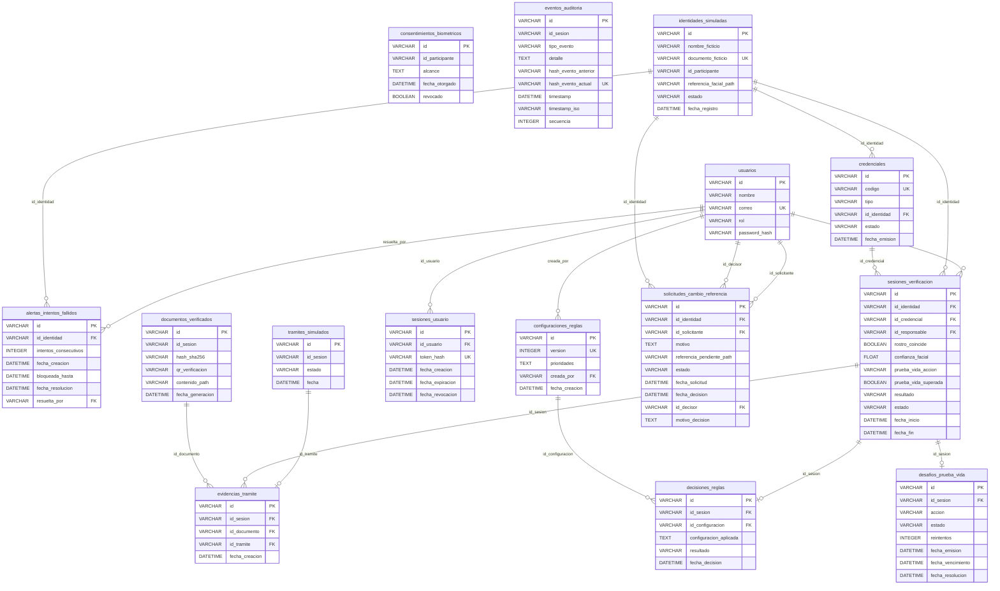
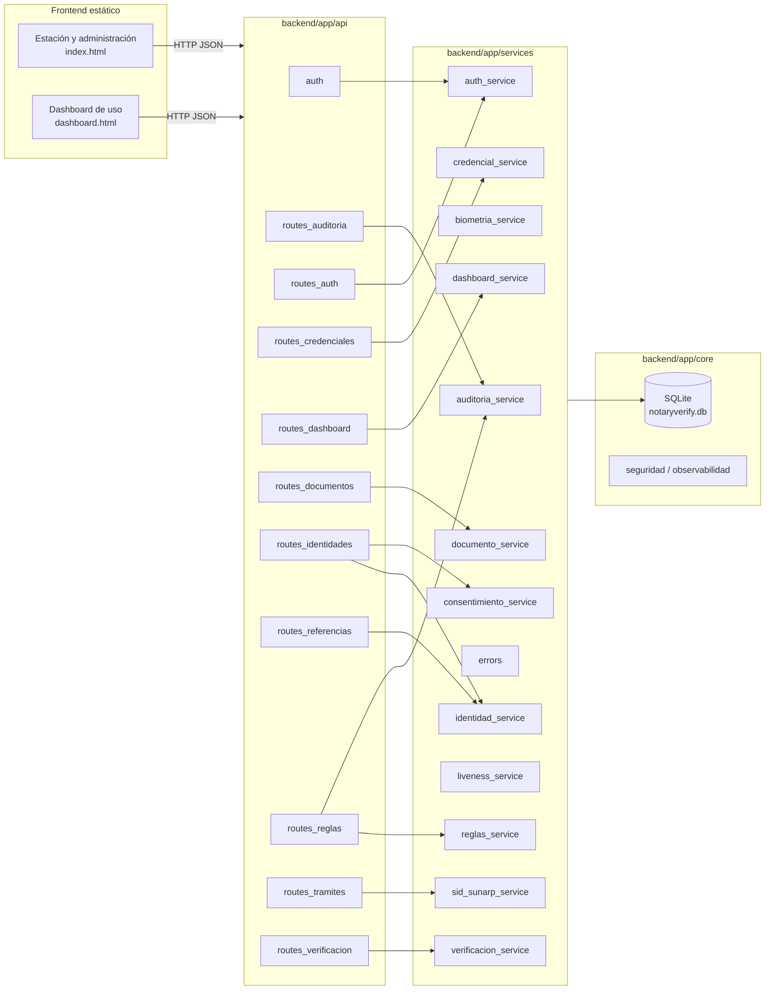
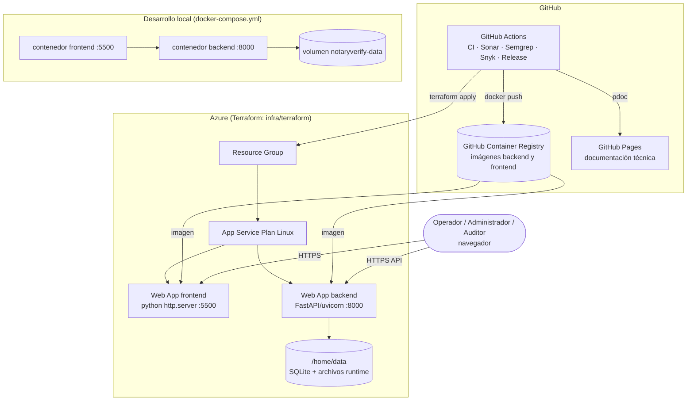

# NotaryVerify

Prototipo académico de verificación multicapa de identidad para trámites notariales simulados. Evalúa credenciales de prueba, identidad simulada, reconocimiento facial local, prueba de vida, reglas de seguridad, integridad documental y auditoría.

> Aviso: NotaryVerify no sustituye a Reniec, SID-Sunarp, firma digital oficial ni procedimientos notariales. Sus resultados no tienen valor de identificación legal. Solo se permiten identidades ficticias y biometría de voluntarios con consentimiento.

## Estado público

- Código fuente, issues, hitos y resultados de CI:
  [repositorio público en GitHub](https://github.com/UPT-FAING-EPIS/proyecto-si784-2026-ii-myprojectgroupcypw).
- El proyecto no tiene una aplicación pública desplegada. La demostración se
  ejecuta localmente mediante las instrucciones de este README o Docker Compose;
  no se debe interpretar la ausencia de una URL pública como una integración con
  servicios institucionales reales.
- M1 a M6 están cerrados y validados por CI. M7 requiere evaluación biométrica
  y de prueba de vida con personas voluntarias y consentimiento; M8 depende de
  esa evidencia y del cierre de trazabilidad. Los pendientes se mantienen
  visibles en las issues #26 a #29.

## MVP

El flujo actual registra una identidad ficticia, emite una credencial QR de prueba, crea una sesión, compara un rostro, solicita una prueba de vida y aplica reglas para emitir un resultado. La evidencia incluye auditoría encadenada, hash SHA-256 de documentos de prueba y trámites simulados.

RFID físico, formato de evaluación biométrica y migraciones formales de SQLite permanecen como decisiones futuras.

## Componentes

- backend/: API FastAPI, SQLAlchemy, SQLite local, OpenCV/MediaPipe y pruebas pytest.
- frontend/: estación de verificación estática y panel administrativo.
- documentacion/: documentación canónica, planificación, operación y fuentes académicas.
- openspec/: propuestas, especificaciones y tareas de cambio.
- AGENTS.md: reglas para personas y agentes.

## Inicio local

### Nativo

1. En backend, crear entorno virtual e instalar requirements.txt.
2. Ejecutar uvicorn app.main:app --reload.
3. En otra terminal, desde frontend, ejecutar python -m http.server 5500.
4. Abrir http://127.0.0.1:5500. La API está en http://127.0.0.1:8000 y Swagger en /docs.

La primera prueba biométrica puede requerir conexión para descargar modelos. El estado runtime se crea en backend/data y no se versiona.

### Docker Compose

Copiar .env.example como .env si se requiere modificar puertos y ejecutar docker compose up --build. La configuración representa solo desarrollo local con SQLite; no crea ni conecta servicios institucionales.

## Documentación y colaboración

Empieza en [documentacion/indice.md](documentacion/indice.md). Consulta [AGENTS.md](AGENTS.md) antes de modificar el repositorio. Los informes académicos históricos están preservados e indexados en [documentacion/academica](documentacion/academica/indice.md).

Para cambios significativos, crear primero una propuesta OpenSpec. El cambio de bootstrap actual es bootstrap-profesional-notaryverify.

<!-- AUTODOC:INICIO -->

## Documentación generada automáticamente

> Sección regenerada por `.github/workflows/documentacion-readme.yml` con `python .github/scripts/generar_documentacion.py`. No editar a mano.

### Diccionario de datos

#### `alertas_intentos_fallidos` (AlertaIntentosFallidos)

| Columna | Tipo | PK | FK | Nulo | Único | Índice |
| --- | --- | --- | --- | --- | --- | --- |
| `id` | VARCHAR(32) | Sí |  | No |  |  |
| `id_identidad` | VARCHAR(32) |  | `identidades_simuladas.id` | No |  | Sí |
| `intentos_consecutivos` | INTEGER |  |  | No |  |  |
| `fecha_creacion` | DATETIME |  |  | No |  |  |
| `bloqueada_hasta` | DATETIME |  |  | No |  |  |
| `fecha_resolucion` | DATETIME |  |  | Sí |  |  |
| `resuelta_por` | VARCHAR(32) |  | `usuarios.id` | Sí |  |  |

#### `configuraciones_reglas` (ConfiguracionReglas)

| Columna | Tipo | PK | FK | Nulo | Único | Índice |
| --- | --- | --- | --- | --- | --- | --- |
| `id` | VARCHAR(32) | Sí |  | No |  |  |
| `version` | INTEGER |  |  | No | Sí | Sí |
| `prioridades` | TEXT |  |  | No |  |  |
| `creada_por` | VARCHAR(32) |  | `usuarios.id` | Sí |  |  |
| `fecha_creacion` | DATETIME |  |  | No |  |  |

#### `consentimientos_biometricos` (ConsentimientoBiometrico)

| Columna | Tipo | PK | FK | Nulo | Único | Índice |
| --- | --- | --- | --- | --- | --- | --- |
| `id` | VARCHAR(32) | Sí |  | No |  |  |
| `id_participante` | VARCHAR(120) |  |  | No |  | Sí |
| `alcance` | TEXT |  |  | No |  |  |
| `fecha_otorgado` | DATETIME |  |  | No |  |  |
| `revocado` | BOOLEAN |  |  | No |  |  |

#### `credenciales` (Credencial)

| Columna | Tipo | PK | FK | Nulo | Único | Índice |
| --- | --- | --- | --- | --- | --- | --- |
| `id` | VARCHAR(32) | Sí |  | No |  |  |
| `codigo` | VARCHAR(64) |  |  | No | Sí | Sí |
| `tipo` | VARCHAR(10) |  |  | No |  |  |
| `id_identidad` | VARCHAR(32) |  | `identidades_simuladas.id` | No |  |  |
| `estado` | VARCHAR(20) |  |  | No |  |  |
| `fecha_emision` | DATETIME |  |  | No |  |  |

#### `decisiones_reglas` (DecisionReglas)

| Columna | Tipo | PK | FK | Nulo | Único | Índice |
| --- | --- | --- | --- | --- | --- | --- |
| `id` | VARCHAR(32) | Sí |  | No |  |  |
| `id_sesion` | VARCHAR(32) |  | `sesiones_verificacion.id` | No | Sí | Sí |
| `id_configuracion` | VARCHAR(32) |  | `configuraciones_reglas.id` | No |  |  |
| `configuracion_aplicada` | TEXT |  |  | No |  |  |
| `resultado` | VARCHAR(40) |  |  | No |  |  |
| `fecha_decision` | DATETIME |  |  | No |  |  |

#### `desafios_prueba_vida` (DesafioPruebaVida)

| Columna | Tipo | PK | FK | Nulo | Único | Índice |
| --- | --- | --- | --- | --- | --- | --- |
| `id` | VARCHAR(32) | Sí |  | No |  |  |
| `id_sesion` | VARCHAR(32) |  | `sesiones_verificacion.id` | No | Sí | Sí |
| `accion` | VARCHAR(20) |  |  | No |  |  |
| `estado` | VARCHAR(20) |  |  | No |  |  |
| `reintentos` | INTEGER |  |  | No |  |  |
| `fecha_emision` | DATETIME |  |  | No |  |  |
| `fecha_vencimiento` | DATETIME |  |  | No |  |  |
| `fecha_resolucion` | DATETIME |  |  | Sí |  |  |

#### `documentos_verificados` (DocumentoVerificado)

| Columna | Tipo | PK | FK | Nulo | Único | Índice |
| --- | --- | --- | --- | --- | --- | --- |
| `id` | VARCHAR(32) | Sí |  | No |  |  |
| `id_sesion` | VARCHAR(32) |  |  | No |  | Sí |
| `hash_sha256` | VARCHAR(64) |  |  | No |  |  |
| `qr_verificacion` | VARCHAR(255) |  |  | No |  |  |
| `contenido_path` | VARCHAR(255) |  |  | No |  |  |
| `fecha_generacion` | DATETIME |  |  | No |  |  |

#### `eventos_auditoria` (EventoAuditoria)

| Columna | Tipo | PK | FK | Nulo | Único | Índice |
| --- | --- | --- | --- | --- | --- | --- |
| `id` | VARCHAR(32) | Sí |  | No |  |  |
| `id_sesion` | VARCHAR(32) |  |  | Sí |  | Sí |
| `tipo_evento` | VARCHAR(60) |  |  | No |  |  |
| `detalle` | TEXT |  |  | No |  |  |
| `hash_evento_anterior` | VARCHAR(64) |  |  | No |  |  |
| `hash_evento_actual` | VARCHAR(64) |  |  | No | Sí |  |
| `timestamp` | DATETIME |  |  | No |  |  |
| `timestamp_iso` | VARCHAR(40) |  |  | No |  |  |
| `secuencia` | INTEGER |  |  | No |  |  |

#### `evidencias_tramite` (EvidenciaTramite)

| Columna | Tipo | PK | FK | Nulo | Único | Índice |
| --- | --- | --- | --- | --- | --- | --- |
| `id` | VARCHAR(32) | Sí |  | No |  |  |
| `id_sesion` | VARCHAR(32) |  | `sesiones_verificacion.id` | No |  | Sí |
| `id_documento` | VARCHAR(32) |  | `documentos_verificados.id` | No |  | Sí |
| `id_tramite` | VARCHAR(32) |  | `tramites_simulados.id` | No | Sí | Sí |
| `fecha_creacion` | DATETIME |  |  | No |  |  |

#### `identidades_simuladas` (IdentidadSimulada)

| Columna | Tipo | PK | FK | Nulo | Único | Índice |
| --- | --- | --- | --- | --- | --- | --- |
| `id` | VARCHAR(32) | Sí |  | No |  |  |
| `nombre_ficticio` | VARCHAR(150) |  |  | No |  |  |
| `documento_ficticio` | VARCHAR(30) |  |  | No | Sí |  |
| `id_participante` | VARCHAR(120) |  |  | No |  |  |
| `referencia_facial_path` | VARCHAR(255) |  |  | No |  |  |
| `estado` | VARCHAR(20) |  |  | No |  |  |
| `fecha_registro` | DATETIME |  |  | No |  |  |

#### `sesiones_usuario` (SesionUsuario)

| Columna | Tipo | PK | FK | Nulo | Único | Índice |
| --- | --- | --- | --- | --- | --- | --- |
| `id` | VARCHAR(32) | Sí |  | No |  |  |
| `id_usuario` | VARCHAR(32) |  | `usuarios.id` | No |  | Sí |
| `token_hash` | VARCHAR(64) |  |  | No | Sí | Sí |
| `fecha_creacion` | DATETIME |  |  | No |  |  |
| `fecha_expiracion` | DATETIME |  |  | No |  |  |
| `fecha_revocacion` | DATETIME |  |  | Sí |  |  |

#### `sesiones_verificacion` (SesionVerificacion)

| Columna | Tipo | PK | FK | Nulo | Único | Índice |
| --- | --- | --- | --- | --- | --- | --- |
| `id` | VARCHAR(32) | Sí |  | No |  |  |
| `id_identidad` | VARCHAR(32) |  | `identidades_simuladas.id` | Sí |  |  |
| `id_credencial` | VARCHAR(32) |  | `credenciales.id` | Sí |  |  |
| `id_responsable` | VARCHAR(32) |  | `usuarios.id` | Sí |  |  |
| `rostro_coincide` | BOOLEAN |  |  | Sí |  |  |
| `confianza_facial` | FLOAT |  |  | Sí |  |  |
| `prueba_vida_accion` | VARCHAR(20) |  |  | Sí |  |  |
| `prueba_vida_superada` | BOOLEAN |  |  | Sí |  |  |
| `resultado` | VARCHAR(40) |  |  | Sí |  |  |
| `estado` | VARCHAR(20) |  |  | No |  |  |
| `fecha_inicio` | DATETIME |  |  | No |  |  |
| `fecha_fin` | DATETIME |  |  | Sí |  |  |

#### `solicitudes_cambio_referencia` (SolicitudCambioReferencia)

| Columna | Tipo | PK | FK | Nulo | Único | Índice |
| --- | --- | --- | --- | --- | --- | --- |
| `id` | VARCHAR(32) | Sí |  | No |  |  |
| `id_identidad` | VARCHAR(32) |  | `identidades_simuladas.id` | No |  | Sí |
| `id_solicitante` | VARCHAR(32) |  | `usuarios.id` | No |  |  |
| `motivo` | TEXT |  |  | No |  |  |
| `referencia_pendiente_path` | VARCHAR(255) |  |  | No |  |  |
| `estado` | VARCHAR(16) |  |  | No |  |  |
| `fecha_solicitud` | DATETIME |  |  | No |  |  |
| `fecha_decision` | DATETIME |  |  | Sí |  |  |
| `id_decisor` | VARCHAR(32) |  | `usuarios.id` | Sí |  |  |
| `motivo_decision` | TEXT |  |  | Sí |  |  |

#### `tramites_simulados` (TramiteSimulado)

| Columna | Tipo | PK | FK | Nulo | Único | Índice |
| --- | --- | --- | --- | --- | --- | --- |
| `id` | VARCHAR(32) | Sí |  | No |  |  |
| `id_sesion` | VARCHAR(32) |  |  | No |  | Sí |
| `estado` | VARCHAR(20) |  |  | No |  |  |
| `fecha` | DATETIME |  |  | No |  |  |

#### `usuarios` (Usuario)

| Columna | Tipo | PK | FK | Nulo | Único | Índice |
| --- | --- | --- | --- | --- | --- | --- |
| `id` | VARCHAR(32) | Sí |  | No |  |  |
| `nombre` | VARCHAR(120) |  |  | No |  |  |
| `correo` | VARCHAR(150) |  |  | No | Sí |  |
| `rol` | VARCHAR(20) |  |  | No |  |  |
| `password_hash` | VARCHAR(128) |  |  | No |  |  |

### Diagrama entidad-relación

### Diagrama de clases

```mermaid
classDiagram
    direction LR
    class AlertaIntentosFallidos {
        <<entity>>
        +VARCHAR id
        +VARCHAR id_identidad
        +INTEGER intentos_consecutivos
        +DATETIME fecha_creacion
        +DATETIME bloqueada_hasta
        +DATETIME fecha_resolucion
        +VARCHAR resuelta_por
    }
    class ConfiguracionReglas {
        <<entity>>
        +VARCHAR id
        +INTEGER version
        +TEXT prioridades
        +VARCHAR creada_por
        +DATETIME fecha_creacion
    }
    class ConsentimientoBiometrico {
        <<entity>>
        +VARCHAR id
        +VARCHAR id_participante
        +TEXT alcance
        +DATETIME fecha_otorgado
        +BOOLEAN revocado
    }
    class Credencial {
        <<entity>>
        +VARCHAR id
        +VARCHAR codigo
        +VARCHAR tipo
        +VARCHAR id_identidad
        +VARCHAR estado
        +DATETIME fecha_emision
    }
    class DecisionReglas {
        <<entity>>
        +VARCHAR id
        +VARCHAR id_sesion
        +VARCHAR id_configuracion
        +TEXT configuracion_aplicada
        +VARCHAR resultado
        +DATETIME fecha_decision
    }
    class DesafioPruebaVida {
        <<entity>>
        +VARCHAR id
        +VARCHAR id_sesion
        +VARCHAR accion
        +VARCHAR estado
        +INTEGER reintentos
        +DATETIME fecha_emision
        +DATETIME fecha_vencimiento
        +DATETIME fecha_resolucion
    }
    class DocumentoVerificado {
        <<entity>>
        +VARCHAR id
        +VARCHAR id_sesion
        +VARCHAR hash_sha256
        +VARCHAR qr_verificacion
        +VARCHAR contenido_path
        +DATETIME fecha_generacion
    }
    class EventoAuditoria {
        <<entity>>
        +VARCHAR id
        +VARCHAR id_sesion
        +VARCHAR tipo_evento
        +TEXT detalle
        +VARCHAR hash_evento_anterior
        +VARCHAR hash_evento_actual
        +DATETIME timestamp
        +VARCHAR timestamp_iso
        +INTEGER secuencia
    }
    class EvidenciaTramite {
        <<entity>>
        +VARCHAR id
        +VARCHAR id_sesion
        +VARCHAR id_documento
        +VARCHAR id_tramite
        +DATETIME fecha_creacion
    }
    class IdentidadSimulada {
        <<entity>>
        +VARCHAR id
        +VARCHAR nombre_ficticio
        +VARCHAR documento_ficticio
        +VARCHAR id_participante
        +VARCHAR referencia_facial_path
        +VARCHAR estado
        +DATETIME fecha_registro
    }
    class SesionUsuario {
        <<entity>>
        +VARCHAR id
        +VARCHAR id_usuario
        +VARCHAR token_hash
        +DATETIME fecha_creacion
        +DATETIME fecha_expiracion
        +DATETIME fecha_revocacion
    }
    class SesionVerificacion {
        <<entity>>
        +VARCHAR id
        +VARCHAR id_identidad
        +VARCHAR id_credencial
        +VARCHAR id_responsable
        +BOOLEAN rostro_coincide
        +FLOAT confianza_facial
        +VARCHAR prueba_vida_accion
        +BOOLEAN prueba_vida_superada
        +VARCHAR resultado
        +VARCHAR estado
        +DATETIME fecha_inicio
        +DATETIME fecha_fin
    }
    class SolicitudCambioReferencia {
        <<entity>>
        +VARCHAR id
        +VARCHAR id_identidad
        +VARCHAR id_solicitante
        +TEXT motivo
        +VARCHAR referencia_pendiente_path
        +VARCHAR estado
        +DATETIME fecha_solicitud
        +DATETIME fecha_decision
        +VARCHAR id_decisor
        +TEXT motivo_decision
    }
    class TramiteSimulado {
        <<entity>>
        +VARCHAR id
        +VARCHAR id_sesion
        +VARCHAR estado
        +DATETIME fecha
    }
    class Usuario {
        <<entity>>
        +VARCHAR id
        +VARCHAR nombre
        +VARCHAR correo
        +VARCHAR rol
        +VARCHAR password_hash
    }
    class AuditoriaService {
        <<service>>
        +registrar_evento()
        +listar_eventos()
        +reconstruir_sesion()
        +verificar_cadena()
    }
    class AuthService {
        <<service>>
        +create_user()
        +login()
        +current_user()
        +logout()
    }
    class BiometriaService {
        <<service>>
        +comparar_rostro()
    }
    class ConsentimientoService {
        <<service>>
        +otorgar()
        +existe_consentimiento_valido()
        +revocar()
    }
    class LectorRfid {
        <<service>>
        +leer()
    }
    class AdaptadorRfidSimulado {
        <<service>>
        +leer()
    }
    class CredencialService {
        <<service>>
        +emitir()
        +listar()
        +leer()
        +leer_rfid()
        +revocar()
        +generar_imagen_qr()
    }
    class DashboardService {
        <<service>>
        +resumen_uso()
    }
    class DocumentoService {
        <<service>>
        +generar_documento()
        +generar_imagen_qr()
        +verificar_integridad()
        +integridad_vigente()
        +consultar_qr()
    }
    class IdentidadService {
        <<service>>
        +registrar()
        +listar()
        +consultar()
        +bloquear()
        +cambiar_estado()
        +actualizar()
        +referencia_facial_bytes()
        +solicitar_cambio_referencia()
        +decidir_cambio_referencia()
        +listar_solicitudes_cambio_referencia()
    }
    class LivenessService {
        <<service>>
        +validar_accion()
    }
    class ReglasService {
        <<service>>
        +validar_prioridades()
        +activa()
        +crear_configuracion()
        +prioridades_aplicables()
        +evaluar()
        +registrar_decision()
    }
    class SidSunarpSimuladoService {
        <<service>>
        +enviar_tramite()
        +obtener_evidencia()
    }
    class VerificacionService {
        <<service>>
        +iniciar_sesion()
        +listar_alertas()
        +resolver_alerta()
        +expirar_sesiones_vencidas()
        +listar_sesiones()
        +registrar_captura_facial()
        +emitir_desafio_prueba_vida()
        +registrar_prueba_vida()
    }
    AdaptadorRfidSimulado ..> Credencial : usa
    AuditoriaService ..> EventoAuditoria : usa
    AuditoriaService ..> SesionVerificacion : usa
    AuthService ..> SesionUsuario : usa
    AuthService ..> Usuario : usa
    ConfiguracionReglas "1" -- "*" DecisionReglas : id_configuracion
    ConsentimientoService ..> ConsentimientoBiometrico : usa
    Credencial "1" -- "*" SesionVerificacion : id_credencial
    CredencialService ..> Credencial : usa
    DashboardService ..> AlertaIntentosFallidos : usa
    DashboardService ..> Credencial : usa
    DashboardService ..> DocumentoVerificado : usa
    DashboardService ..> EventoAuditoria : usa
    DashboardService ..> IdentidadSimulada : usa
    DashboardService ..> SesionVerificacion : usa
    DashboardService ..> TramiteSimulado : usa
    DashboardService ..> Usuario : usa
    DocumentoService ..> DocumentoVerificado : usa
    DocumentoService ..> SesionVerificacion : usa
    DocumentoVerificado "1" -- "*" EvidenciaTramite : id_documento
    IdentidadService ..> IdentidadSimulada : usa
    IdentidadService ..> SolicitudCambioReferencia : usa
    IdentidadSimulada "1" -- "*" AlertaIntentosFallidos : id_identidad
    IdentidadSimulada "1" -- "*" SesionVerificacion : id_identidad
    IdentidadSimulada "1" -- "*" SolicitudCambioReferencia : id_identidad
    IdentidadSimulada "1" --> "*" Credencial
    LectorRfid ..> Credencial : usa
    ReglasService ..> ConfiguracionReglas : usa
    ReglasService ..> DecisionReglas : usa
    ReglasService ..> SesionVerificacion : usa
    SesionVerificacion "1" -- "*" DecisionReglas : id_sesion
    SesionVerificacion "1" -- "*" DesafioPruebaVida : id_sesion
    SesionVerificacion "1" -- "*" EvidenciaTramite : id_sesion
    SidSunarpSimuladoService ..> DocumentoVerificado : usa
    SidSunarpSimuladoService ..> EvidenciaTramite : usa
    SidSunarpSimuladoService ..> SesionVerificacion : usa
    SidSunarpSimuladoService ..> TramiteSimulado : usa
    TramiteSimulado "1" -- "*" EvidenciaTramite : id_tramite
    Usuario "1" -- "*" AlertaIntentosFallidos : resuelta_por
    Usuario "1" -- "*" ConfiguracionReglas : creada_por
    Usuario "1" -- "*" SesionUsuario : id_usuario
    Usuario "1" -- "*" SesionVerificacion : id_responsable
    Usuario "1" -- "*" SolicitudCambioReferencia : id_decisor
    Usuario "1" -- "*" SolicitudCambioReferencia : id_solicitante
    VerificacionService ..> AlertaIntentosFallidos : usa
    VerificacionService ..> DesafioPruebaVida : usa
    VerificacionService ..> SesionVerificacion : usa
```

### Diagrama de componentes

### Diagrama de despliegue

<!-- AUTODOC:FIN -->
